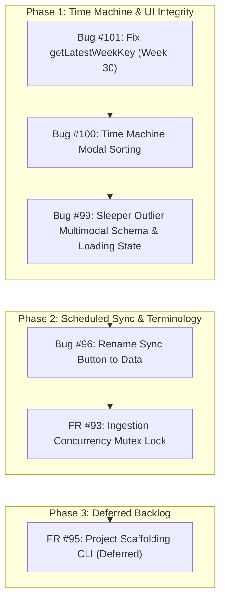

# Phased Bug Implementation Plan (Balanced Mode)

> **Target Version**: Project Monaro Platform Hardening  
> **Date Generated**: 2026-09-02  
> **Strategy**: Balanced Quality & Traversal Integrity (Prioritizing High-Impact / Low-Risk UI & Time Machine fixes first, deferring FR #95 per user request)

---

## 1. Executive Summary

This implementation plan coordinates the resolution of all currently active bugs and enhancement requests in the Project Monaro dashboard repository. Following the user's directive (`ignore 95 for now`), scaffolding enhancements (FR #95) are deferred to the future backlog.

The execution is organized into **2 focused delivery phases**:
1. **Phase 1: Time Machine & UI Traversal Integrity** (Bugs #101, #100, #99) — Eliminates navigation regressions in the Governance Time Machine (jumping to Week 27 instead of Week 30, out-of-order snapshot listings) and fixes multimodal schema parsing on the Early Warning Sleeper Outlier panel.
2. **Phase 2: Scheduled Sync Terminology & Execution Safety** (Bugs #96, #93) — Aligns dashboard header UI terminology ('Data' vs 'Sync') with the scheduled background Cloud Run ingestion architecture and hardens process-level sync locking.

---

## 2. Phased Execution Roadmap

### **Phase 1: Time Machine & UI Integrity (Immediate Priority / Low Risk)**

| Bug ID | Type | Priority | Impact | Risk | Description |
| :--- | :--- | :--- | :--- | :--- | :--- |
| **#101** | `Bug` | **P1** | **High** | **Low** | Clicking 'Return to week 30' (current week) navigates to week 27 instead |
| **#100** | `Bug` | **P1** | **Medium** | **Low** | Time Machine weekly snapshots modal list is rendered out of sequence |
| **#99** | `Bug` | **P1** | **High** | **Low** | Early Warning Sleeper Outlier panel renders blank without content |

#### Detailed Phase 1 Technical Plans:

#### **Bug #101: Fix Return to Present & getLatestWeekKey Resolution**
* **Root Cause**: In `src/js/app.js`, `getLatestWeekKey()` evaluates `for (const [key, snap] of Object.entries(TIME_MACHINE_SNAPSHOTS))` and immediately returns the first key where `snap.isCurrent || snap.isLatest` is true (which evaluates to older snapshot `w27`), rather than computing the maximum week number (`maxWeekNumber` e.g. Week 30).
* **Fix Strategy**:
  1. Refactor `getLatestWeekKey()` to calculate the maximum integer week number across all snapshot keys and properties (`snap.weekNumber || parseInt(key.replace(/\D/g, ''))`).
  2. Ensure `returnToPresent()` and `activateTimeMachine()` always navigate to the true highest reporting week.
* **Verification**: Add automated unit test `test_get_latest_week_key_resolves_highest_week` in `tests/test_server_parameterized.py` asserting that `getLatestWeekKey()` returns `w30` / `Week 30` even when legacy snapshots have `isLatest: true`.

#### **Bug #100: Chronological Sorting of Time Machine Modal List**
* **Root Cause**: `renderTimeMachineModalList()` in `src/js/app.js` iterates `Object.entries(TIME_MACHINE_SNAPSHOTS)` in native JavaScript object key insertion order without sorting chronologically.
* **Fix Strategy**:
  1. In `renderTimeMachineModalList()`, sort entries in descending chronological order by week number (`(b[1].weekNumber || parseInt(b[0].replace(/\D/g, ''))) - (a[1].weekNumber || parseInt(a[0].replace(/\D/g, '')))`).
  2. Ensure the newest snapshot (Present Live) appears at the very top of the list, followed by preceding historical weeks in exact descending sequence (Week 30, Week 29, Week 28, Week 27 ... Week 4).
* **Verification**: Add automated unit test asserting modal list entries are strictly ordered descending by week number.

#### **Bug #99: Early Warning Sleeper Outlier Parsing & Container State**
* **Root Cause**:
  1. In `index.html`, `#sleeperOutlierContainer` lacks default `hidden` class, rendering unpopulated placeholder text while briefing data loads.
  2. In `src/js/app.js`, sleeper outlier parser checks `sl.risk || sl.description || sl.title` and `sl.trigger || sl.triggerCondition || sl.action || sl.ref`, ignoring `sl.warning` (which is standard in Gemini multimodal snapshot extraction).
* **Fix Strategy**:
  1. In `src/js/app.js`, update `hasOutlierData` and text formatting to support `sl.warning`, `sl.risk`, `sl.description`, `sl.title`, `sl.ref`, and `sl.trigger`.
  2. In `index.html`, add default `hidden` class to `#sleeperOutlierContainer` so it remains concealed until valid snapshot outlier data is rendered.
* **Verification**: Add unit test asserting sleeper outlier container renders formatted content when given multimodal snapshot schema with `warning` and `ref`.

---

### **Phase 2: Scheduled Sync Terminology & Execution Safety**

| Bug ID | Type | Priority | Impact | Risk | Description |
| :--- | :--- | :--- | :--- | :--- | :--- |
| **#96** | `Bug` | **P3** | **Low** | **Low** | Change 'Sync' button label to 'Data' to reflect scheduled sync architecture |
| **#93** | `FR` | **P2** | **Medium** | **Low** | Add active execution check to prevent duplicate concurrent sync runs |

#### Detailed Phase 2 Technical Plans:

#### **Bug #96: Header Navigation Button Terminology Alignment**
* **Root Cause**: The top navigation button in `index.html` is labeled 'Sync' with a refresh icon, implying users must manually trigger syncs, whereas data is automatically synchronized on schedule via background Cloud Run jobs and served via the Read-Only Data Provenance Hub.
* **Fix Strategy**:
  1. In `index.html`, change button label from 'Sync' to 'Data', adjust icon and tooltip to 'Data Provenance & Source Hub'.
  2. Align modal header text and accessibility labels in `src/js/app.js`.
* **Verification**: Add unit test verifying 'Data' button exists and triggers the Data Provenance Hub modal cleanly.

#### **FR #93: Active Execution Lock & Concurrency Prevention**
* **Root Cause**: Multiple manual UI clicks or automated triggers could initiate overlapping ingestion jobs, risking duplicate writes or file access contention in `snapshots.json`.
* **Fix Strategy**:
  1. In `scripts/sync_drive.py` and `scripts/trigger_sync.py`, implement atomic file locking (`.sync.lock`) and Cloud Run Job execution status check.
  2. Ensure server `/api/sync` and CLI tools return clean `status: in_progress` if an existing sync process is active.
* **Verification**: Add unit test verifying concurrent sync requests return `status: in_progress`.

---

### **Phase 3: Backlog & Deferred Enhancements**

| Bug ID | Type | Priority | Impact | Risk | Status |
| :--- | :--- | :--- | :--- | :--- | :--- |
| **#95** | `FR` | **P3** | **Medium** | **Low** | Support adding and scaffolding new projects dynamically (`ignore 95 for now`) |
| **#6** | `FR` | **P2** | **Medium** | **Low** | Editable Gemini executive summary prompt in settings |
| **#9** | `FR` | **P2** | **Medium** | **Low** | Horizontal Time Machine scrubbing chips in orange header |
| **#16** | `FR` | **P2** | **High** | **Low** | Interactive human-readable Sheet/Drive picker |
| **#17** | `FR` | **P2** | **Medium** | **Low** | Interactive sorting and column filtering on Whole Register Ledger |
| **#18** | `FR` | **P2** | **High** | **Medium** | Full multi-week historical sync back to Week 5 |
| **#24** | `FR` | **P2** | **Medium** | **Low** | Automated slide deck export for executive briefing panels |

---

## 3. Execution Sequence & Inter-Bug Dependencies

---

## 4. Verification Standard

Every fix must adhere strictly to the project engineering standard:
1. **Reproduction Unit Test**: Authored before modifying source code.
2. **Implementation**: Native surgical file editing using `replace_file_content`.
3. **Automated Verification**: Full pytest test suite (178+ tests) passing with 0 failures before verification closure.
