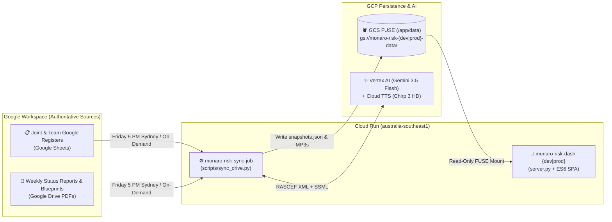

# 📊 Project Dash — Executive Risk & Programme Intelligence Platform


A Google Cloud serverless executive risk governance and programme intelligence platform built for **Project Monaro (`?project=monaro`)** and public showcases (`?project=sample`). It combines deterministic **ISO 31000 5×5 risk governance**, automated **Google Workspace Sheet/Drive synchronization**, **dynamic historical baseline diffing**, and **AI-synthesized executive audio briefings** (`Gemini 3.5 Flash` + `Chirp 3 HD`).

---

## 🌐 Live Environments & Quick Links (`australia-southeast1`)

| Environment | GCP Project | Dashboard URL | Cloud Run Console | Authoritative GCS Bucket |
| :--- | :--- | :--- | :--- | :--- |
| **Development** | `monaro-risk-dev` | [Open Dev Dashboard](https://monaro-risk-dash-dev-525025654699.australia-southeast1.run.app/?project=monaro) | [Cloud Run (`monaro-risk-dash-dev`)](https://console.cloud.google.com/run/detail/australia-southeast1/monaro-risk-dash-dev/metrics?project=monaro-risk-dev&authuser=4) | [`gs://monaro-risk-dev-data/`](https://console.cloud.google.com/storage/browser/monaro-risk-dev-data?project=monaro-risk-dev&authuser=4) |
| **Production** | `monaro-risk-prod` | [Open Prod Dashboard](https://monaro-risk-dash-prod-525025654699.australia-southeast1.run.app/?project=monaro) | [Cloud Run (`monaro-risk-dash-prod`)](https://console.cloud.google.com/run/detail/australia-southeast1/monaro-risk-dash-prod/metrics?project=monaro-risk-prod&authuser=4) | [`gs://monaro-risk-prod-data/`](https://console.cloud.google.com/storage/browser/monaro-risk-prod-data?project=monaro-risk-prod&authuser=4) |
| **Local Dev** | Localhost | [`http://localhost:9000/?project=monaro`](http://localhost:9000/?project=monaro) | `./run_server.sh` | `data/monaro/` |

* **90-Day Sandbox Expiration Notice**: Both `monaro-risk-dev` and `monaro-risk-prod` expire **15 November 2026** unless linked to a permanent billing account. See the [Admin & Developer Guide](docs/ADMIN_DEV_GUIDE.md#1-critical-invariants--operational-gotchas) for the 1-command migration step.

---

## 📚 Role-Based Documentation Index

1. **[📋 Project Manager & Governance User Guide (`docs/PM_USER_GUIDE.md`)](docs/PM_USER_GUIDE.md)**
   * **Audience**: Project Managers, Workstream Leads, Programme Directors.
   * **Contents**: Navigating **Tabs 1–7**, unlocking the hidden **Tab 8 (`📋 Whole Register Ledger`)** & **`📥 Export CSV`** (`?view=pm` / `&ledger=true`), running **Dynamic Baseline Diffing** (`Show changes since:`), syncing live Google Sheets via **`Data` → `↻ Check for Updates`**, using the **`⏱️ Time Machine`**, and **ISO 31000 5×5 RAG** thresholds.
2. **[🛠️ Administrator & Developer Guide (`docs/ADMIN_DEV_GUIDE.md`)](docs/ADMIN_DEV_GUIDE.md)**
   * **Audience**: GCP/Linux Engineers and System Administrators.
   * **Contents**: Sandbox billing migration, environment matrix, `CLOUD_LOGGING_ONLY` build diagnostics (`scripts/check_build_status.py`), Dual Git Remote workflow (`origin` vs `depot` with `-S` SSH signing), GCS FUSE config sync (`scripts/pipeline.py`), frontend ES6 `window.*` binding contract, and RASCEF XML prompt rules.
3. **[🎤 5-Minute Team Presentation Script (`docs/TEAM_PRESENTATION_GUIDE.md`)](docs/TEAM_PRESENTATION_GUIDE.md)**
   * **Audience**: Presenters running live executive or stakeholder walkthroughs.
   * **Contents**: Step-by-step showcase script aligned to the live UI tabs and controls.

---

## 🏗️ System Architecture



---

## ⚡ 30-Second Developer Quickstart

```bash
# 1. Install Python (uv) and Node (ESLint/Vitest) dependencies
uv sync && npm install

# 2. Audit all 46 GCP resources & IAM bindings in parallel (< 5s read-only check)
./setup.sh -l --env dev

# 3. Pull authoritative config.json from GCS into local data/monaro/
python3 scripts/pipeline.py --pull-config --project monaro

# 4. Start local server on http://localhost:9000/?project=monaro
./run_server.sh

# 5. Run full 5-layer verification suite (AST syntax, ESLint, Vitest, and Pytest)
npm run verify && uv run pytest
```

---

## 📂 Repository Layout

```text
├── index.html                   # SPA DOM shell, Tailwind styling, and inline onclick="..." bindings
├── server.py                    # Python HTTP server (serves SPA, /data/* from local/GCS, and /api/* routes)
├── run_server.sh                # Local server lifecycle wrapper (:9000) with <15ms AST syntax gate
├── setup.sh                     # Parallel GCP state inspector (-l) and Terraform environment provisioner
├── src/js/
│   ├── app.js                   # Primary frontend controller, data loader, and window.* global bindings
│   └── modules/                 # Modular ES6 view controllers (exec_briefing, risk_heatmap, risk_explorer, etc.)
├── scripts/
│   ├── sync_drive.py            # Cloud Run Job entrypoint: Drive/Sheets scanner & snapshot updater
│   ├── pipeline.py              # Core ETL engine & GCS config.json pull/push validator
│   ├── gemini_generator.py      # Vertex AI Gemini 3.5 Flash synthesis & Chirp 3 HD audio generator
│   └── check_build_status.py    # Cloud Build log & statusDetail inspector (CLOUD_LOGGING_ONLY)
├── prompts/                     # Externalized RASCEF XML system instructions (exec_summary & podcast)
├── deploy/                      # Unified Dockerfile, cloudbuild.yaml, and Terraform IaC (deploy/terraform/)
├── tests/                       # Pytest backend/contract suites + Vitest frontend unit tests (tests/frontend/)
└── docs/                        # Role-based guides (PM_USER_GUIDE, ADMIN_DEV_GUIDE, TEAM_PRESENTATION_GUIDE)
```
