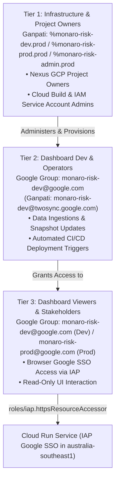

# Project Monaro / F-DSE Risk Governance & Intelligence Platform — Session Resume

**Checkpoint Timestamp:** `2026-08-27 13:01:00 AEST`  
**Active Git Branch:** `dev`  
**Workspace:** `/usr/local/google/home/brendanhills/dev/uk-bh-experiments/project_dash`  
**Deployment Region:** **`australia-southeast1`** (Sydney, Australia)  
**Live Cloud Run Dev Service:** `monaro-risk-dash-dev`  
**Live Cloud Run Prod Service:** `monaro-risk-dash-prod`  
**Local Cloudtop Dev Server:** [Monaro Project](http://uk-bh-cloudtop.c.googlers.com:9000/?project=monaro) | [Aurora Sample](http://uk-bh-cloudtop.c.googlers.com:9000/?project=sample)  
**Test Suite Health:** **127 / 127 Tests Passing (100%)** (`python3 -m unittest discover -s tests -p "test_*.py"` or `python3 -m pytest`).  
**Active Conductor Track:** `modularize_frontend_architecture_20260818` (Status: `[~] In Progress / Active Manual Verification`)

---

## 🌅 Quick-Start Verification Checklist

### 0. Ensure `monaro-risk-prod` GCP Project is Created
* If not yet provisioned, create `monaro-risk-prod` via **[go/nexus](http://go/nexus)** or **[Pantheon > New Project](https://pantheon.corp.google.com/projectcreate)** with an attached billing account.
* Run `./deploy/provision_environment.sh --env prod` to provision all APIs, service accounts, Artifact Registry, triggers, and alerting policies in Sydney (`australia-southeast1`).

### 1. Verify Cloud Build Status & Health via CLI Tool
```bash
# Check latest build in Australia region (Dev)
python3 scripts/check_build_status.py --env dev

# Check latest build in Australia region (Prod)
python3 scripts/check_build_status.py --env prod
```

### 2. Verify Access Groups in Google Groups
* **Dev Viewer Group**: **[Google Groups > monaro-risk-dev](https://groups.google.com/a/google.com/g/monaro-risk-dev/members)**
* **Dev Admin / Alerts Group**: **[Google Groups > monaro-risk-dev-admin](https://groups.google.com/a/google.com/g/monaro-risk-dev-admin/members)**
* **Prod Viewer Group**: **[Google Groups > monaro-risk-prod](https://groups.google.com/a/google.com/g/monaro-risk-prod/members)**
* **Prod Admin / Alerts Group**: **[Google Groups > monaro-risk-prod-admin](https://groups.google.com/a/google.com/g/monaro-risk-prod-admin/members)**

### 3. How to Deploy to Production (Release Tag on `dev`)
```bash
# 1. Create a production release tag on the dev branch
git tag project_dash/prod-v1.0.0

# 2. Push tag to GitHub
git push origin project_dash/prod-v1.0.0
```

### 4. How End Users Sync Live Data in the Dashboard (Hands-Free)
* Open the dashboard in browser.
* Click **"Sync Workspace"** $\\rightarrow$ **"Sync Live Data Now"**.
* The Cloud Run backend (`/api/sync` or `/api/sync-all`) ingests Google Sheets and Drive PDF reports on the fly with zero code redeployments.

---

## 🎯 Executive Summary of Accomplishments

1. **Spec-Driven Development (SDD) Hierarchy & Architecture Overhaul**:
   - Codified the 3-tier architecture guide (`conductor/product.md` for BRD vision/invariants, `conductor/spec.md` for SDD contracts/modules, and `conductor/tracks/` for transient implementation plans).
   - Embedded the **4 core architectural invariants**:
     1. Turnkey Handover & Browser-Triggered Data Operations.
     2. Defensive, Resilient Processing (self-healing fallbacks).
     3. Cohesive, Minimal Unified Architecture.
     4. Zero-Trust Security & Multi-Project Data Isolation (`?project=sample` vs `?project=monaro` / `?project=f-dse`).

2. **Completed Track: `simplify_and_harden_for_handover_20260822`**:
   - Consolidated previously fragmented ingestion scripts into `scripts/pipeline.py` with flexible filename parsing and deterministic self-healing fallbacks.
   - Streamlined `server.py` request handlers into clean REST endpoints (`/api/status`, `/api/sync`, `/api/ingest`, `/api/briefing/generate`) while preserving backward-compatible routing aliases.
   - Closed **Bug #79** (Rationalize server.py REST endpoints) as **Fix Verified**.

3. **Australia Region (`australia-southeast1`) Migration & Infrastructure**:
   - Updated [`deploy/cloudbuild.yaml`](./deploy/cloudbuild.yaml) to provision Artifact Registry and deploy Cloud Run in Sydney, Australia (`australia-southeast1`).
   - Standardized production naming (`monaro-risk-dash-prod`) and created [`deploy/PROD_PROVISIONING_GUIDE.md`](./deploy/PROD_PROVISIONING_GUIDE.md) with turnkey provisioning scripts.
   - Monorepo tag-driven CI/CD: production builds trigger automatically on `project_dash/prod-*` tag push.
   - Multi-environment diagnostics via `scripts/check_build_status.py` (`--env dev` / `--env prod`).

4. **Architecture Drift Audit Executed (`/architecture-drift-evaluation`)**:
   - Scored **Grade A (4.75 / 5.0)** with minimal drift against the SDD.

5. **Workspace Clutter Reduction & Legacy Archiving**:
   - Safely relocated 57 obsolete/prototype root artifacts (`dash_v1/`, `data/notebook/`, `deploy/legacy_*`, React prototype components) into structured `archive/` subdirectories (`archive/dash_v1/`, `archive/legacy_data/`, `archive/legacy_deploy/`, `archive/legacy_react_prototype/`, `archive/legacy_scripts/`, `archive/legacy_tools/`).
   - Reduced workspace root clutter from 19 top-level items down to 7 core canonical directories.
   - Maintained **100% automated test pass rate** (127/127 tests passing) and zero runtime regression.
   - Built and packaged the `workspace_cleanup` skill and automated clutter audit tooling in `custom_harness/`.

---

## 🧭 Current Status of Conductor Tracks

| Track Name | Status | Summary |
| :--- | :---: | :--- |
| `c4a_idp_nexus_deployment_20260811` | **[x] Completed** | Production deployment, Drive-native storage & turnkey handover. |
| `team_google_risk_register_integration_20260813` | **[x] Completed** | Team Google Risk Register integration & multi-register governance. |
| `gemini_notebook_blueprint_sync_20260813` | **[x] Completed** | Gemini Notebook contract blueprint sync & knowledge base. |
| `zero_server_client_architecture_20260814` | **[x] Completed** | Zero-server client-only architecture & multi-notebook registry. |
| `decouple_and_gemini_ingestion_20260817` | **[x] Completed** | Decoupled dashboard content for GitHub & automated Gemini pipeline. |
| `audit_and_dynamic_data_all_tabs_20260811` | **[x] Completed** | Dynamic data generation & visualization audit across all tabs. |
| `customer_feedback_enhancements_20260819` | **[x] Completed** | Customer feedback & strategic advisory enhancements. |
| `simplify_and_harden_for_handover_20260822` | **[x] Completed** | Consolidated unified pipeline, rationalized REST APIs, self-healing fallbacks. |
| `modularize_frontend_architecture_20260818` | **[~] In Progress** | Core ES6 modules created under `src/js/`; active manual verification. |
| `ondemand_podcast_generation_20260820` | **[ ] Queued** | Backend on-demand podcast generation and interactive loading states (Bugs #73, #78). |
| `migrate_from_unittest_to_pytest_20260827` | **[ ] Queued** | Migrate test suite from unittest to idiomatic pytest & shared conftest fixtures. |
| `tailored_stakeholder_views` | **[ ] Queued** | URL-driven views for Exec, PM, and Tech stakeholders. |
| `terraform_iac_provisioning_future` | **[ ] Queued** | Terraform Infrastructure as Code (IaC) provisioning. |

---

## 🏛️ 3-Tier Access Hierarchy Mapping



---

## 💻 Everyday Developer Workflow

```bash
# 1. Run local automated tests to verify changes
python3 -m unittest discover -s tests -p "test_*.py"

# 2. Stage and commit changes on dev
git add .
git commit -m "feat: description of changes"

# 3. Push to origin/dev to trigger automated Dev deployment (Sydney)
git push origin dev

# NOTE: For documentation-only changes that should NOT trigger a new Cloud Run build,
# include [skip ci] or [ci skip] in your commit message:
git commit -m "docs: update provisioning runbook [skip ci]"
git push origin dev

# 4. When ready for a production release, tag on dev
git tag project_dash/prod-v1.0.0
git push origin project_dash/prod-v1.0.0
```

---

## 🚀 Immediate Next Steps

1. **Track `ondemand_podcast_generation_20260820`**:
   - Wire backend `/api/briefing/generate` to trigger neural podcast TTS on demand directly from the UI with an interactive loading spinner.
2. **Continue verification of `modularize_frontend_architecture_20260818`**:
   - Complete browser testing across all 7 tabs using ES modules.

---

## 📂 Key Architecture & File References

- **IAP Console (Dev):** [https://pantheon.corp.google.com/security/iap?project=monaro-risk-dev](https://pantheon.corp.google.com/security/iap?project=monaro-risk-dev)
- **IAP Console (Prod):** [https://pantheon.corp.google.com/security/iap?project=monaro-risk-prod](https://pantheon.corp.google.com/security/iap?project=monaro-risk-prod)
- **Google Group (Dev):** [https://groups.google.com/a/google.com/g/monaro-risk-dev](https://groups.google.com/a/google.com/g/monaro-risk-dev)
- **Google Group (Prod):** [https://groups.google.com/a/google.com/g/monaro-risk-prod](https://groups.google.com/a/google.com/g/monaro-risk-prod)
- **Turnkey Provisioning Script:** [`deploy/provision_environment.sh`](./deploy/provision_environment.sh)
- **Production Provisioning Guide:** [`deploy/PROD_PROVISIONING_GUIDE.md`](./deploy/PROD_PROVISIONING_GUIDE.md)
- **CI/CD Pipeline Definition:** [`deploy/cloudbuild.yaml`](./deploy/cloudbuild.yaml)
- **Build Status Tool:** [`scripts/check_build_status.py`](./scripts/check_build_status.py)
- **API Server & Sync Handler:** [`server.py`](./server.py)
- **Consolidated Pipeline Engine:** [`scripts/pipeline.py`](./scripts/pipeline.py)
- **Handover Guide:** [`docs/HANDOVER_GUIDE.md`](./docs/HANDOVER_GUIDE.md)
