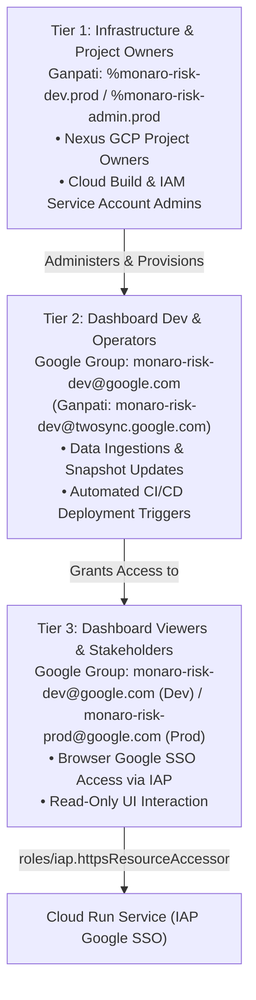

# Project Monaro / F-DSE Risk Governance & Intelligence Platform — Session Resume

**Checkpoint Timestamp:** `2026-08-18 18:25:00 AEST`  
**Active Git Branch:** `dev`  
**Workspace:** `/usr/local/google/home/brendanhills/dev/uk-bh-experiments/project_dash`  
**Live Cloud Run Dev Service:** [https://monaro-risk-dash-dev-525025654699.us-central1.run.app/](https://monaro-risk-dash-dev-525025654699.us-central1.run.app/)  
**Local Cloudtop Dev Server:** [http://uk-bh-cloudtop.c.googlers.com:9000/?project=sample](http://uk-bh-cloudtop.c.googlers.com:9000/?project=sample)  
**Test Suite Health:** **97/97 passing cleanly** (`python3 -m unittest discover -s tests -p "test_*.py"`).  
**Active Conductor Track:** `modularize_frontend_architecture_20260818` (Status: `[ ] Planned`)

---

## 🌅 Quick-Start Verification Checklist

### 1. Verify the Live Deployed Cloud Run Dashboard (30 Seconds)
👉 **[Open Live Deployed Dashboard](https://monaro-risk-dash-dev-525025654699.us-central1.run.app/)**
* Google SSO will authenticate you with your `@google.com` corporate account via Identity-Aware Proxy (IAP).
* Confirm that the 5×5 risk matrix, interactive burndown velocity curves, and podcast audio player load properly.

### 2. Verify Your Group in Pantheon IAP Console
👉 **[Pantheon > Identity-Aware Proxy (IAP) Console](https://pantheon.corp.google.com/security/iap?project=monaro-risk-dev)**
* Select `monaro-risk-dash-dev` under HTTPS Resources.
* Confirm that **`monaro-risk-dev@google.com`** is listed with the role **`IAP-secured Web App User`** (`roles/iap.httpsResourceAccessor`).

### 3. Check Cloud Build Status via CLI Tool
```bash
# Check the latest build status and pipeline health
python3 scripts/check_build_status.py

# Check the last 5 builds
python3 scripts/check_build_status.py --limit 5
```

### 4. How to Manage Team Access Going Forward
You **never need to touch GCP IAM or Pantheon permissions** to manage team access:
* **To add someone**: Go directly to **[Google Groups > monaro-risk-dev](https://groups.google.com/a/google.com/g/monaro-risk-dev/members)** and click **"Add members"**.
* **To remove someone**: Remove them from the Google Group. IAP instantly revokes their access to the dashboard.
* **Production Group**: **[Google Groups > monaro-risk-prod](https://groups.google.com/a/google.com/g/monaro-risk-prod/members)**.

---

## 🎯 Executive Summary of Session Accomplishments

1. **Automated CI/CD Pipeline on Google Cloud Build**:
   - Codified the complete end-to-end automated deployment pipeline in [`deploy/cloudbuild.yaml`](./deploy/cloudbuild.yaml).
   - Configured Cloud Build trigger **`deploy-monaro-risk-dash-dev`** listening to push events on `dev` scoped strictly to `project_dash/**`.
   - Automated 6 sequential pipeline stages: (1) unit testing, (2) Artifact Registry auto-check/create, (3) Docker container build, (4) image push, (5) Cloud Run deploy (`--no-allow-unauthenticated --iap`), and (6) programmatic IAM & IAP policy enforcement.
2. **Zero-Trust Cloud Run Deployment with Native Identity-Aware Proxy (IAP) Google SSO**:
   - Secured Cloud Run behind Identity-Aware Proxy (IAP) with `--no-allow-unauthenticated`.
   - Browser navigation to the service triggers Google corporate SSO, verifying membership against the authorized Google Group allowlist (`monaro-risk-dev@google.com`).
3. **Build Status & Failure Diagnostics Tool**:
   - Built [`scripts/check_build_status.py`](./scripts/check_build_status.py) to query Cloud Build API, inspect step exit codes, and extract tail error logs for failed builds directly from the terminal.
4. **Codified Asynchronous Push Rule**:
   - Persisted [`project_dash/.agents/rules/cicd_deployment_workflow.md`](./.agents/rules/cicd_deployment_workflow.md): pushes trigger background builds non-blockingly without waiting or polling.
5. **Resolved Bug #59 (Driver Tree Clickable Risks & Issues Badges)**:
   - Driver tree deliverable cards now feature clickable related risk/issue badges that instantly filter the risk and issue ledgers.
6. **Frontend Modularization Track Scaffolding**:
   - Planned and registered Track: `modularize_frontend_architecture_20260818` in `conductor/tracks.md`.
7. **Test Suite Health**:
   - **97/97 automated unit and ingestion tests passing cleanly** (`python3 -m unittest discover -s tests -p "test_*.py"`).

---

## 🏛️ 3-Tier Access Hierarchy Mapping



---

## 💻 Everyday Developer Workflow

```bash
# 1. Run local automated tests to verify changes
python3 -m unittest discover -s tests -p "test_*.py"

# 2. Stage and commit changes
git add .
git commit -m "feat: description of changes"

# 3. Push to origin/dev to trigger automated Cloud Build CI/CD deployment
git push origin dev

# 4. (Optional) Check build status asynchronously
python3 scripts/check_build_status.py
```

---

## 📂 Key Architecture & File References

- **Live Deployed URL:** [https://monaro-risk-dash-dev-525025654699.us-central1.run.app/](https://monaro-risk-dash-dev-525025654699.us-central1.run.app/)
- **IAP Console:** [https://pantheon.corp.google.com/security/iap?project=monaro-risk-dev](https://pantheon.corp.google.com/security/iap?project=monaro-risk-dev)
- **Google Group (Dev):** [https://groups.google.com/a/google.com/g/monaro-risk-dev](https://groups.google.com/a/google.com/g/monaro-risk-dev)
- **Google Group (Prod):** [https://groups.google.com/a/google.com/g/monaro-risk-prod](https://groups.google.com/a/google.com/g/monaro-risk-prod)
- **Cloud Build Console:** [https://pantheon.corp.google.com/cloud-build/builds?project=monaro-risk-dev](https://pantheon.corp.google.com/cloud-build/builds?project=monaro-risk-dev)
- **Cloud Run Console:** [https://pantheon.corp.google.com/run?project=monaro-risk-dev](https://pantheon.corp.google.com/run?project=monaro-risk-dev)
- **Deployment Guide:** [`docs/DEPLOYMENT_GUIDE.md`](./docs/DEPLOYMENT_GUIDE.md)
- **Handover Guide:** [`docs/HANDOVER_GUIDE.md`](./docs/HANDOVER_GUIDE.md)
- **Presentation Guide:** [`docs/TEAM_PRESENTATION_GUIDE.md`](./docs/TEAM_PRESENTATION_GUIDE.md)
- **CI/CD Pipeline Definition:** [`deploy/cloudbuild.yaml`](./deploy/cloudbuild.yaml)
- **Build Status Tool:** [`scripts/check_build_status.py`](./scripts/check_build_status.py)
- **Frontend SPA:** [`index.html`](./index.html)
- **API Server:** [`server.py`](./server.py)
