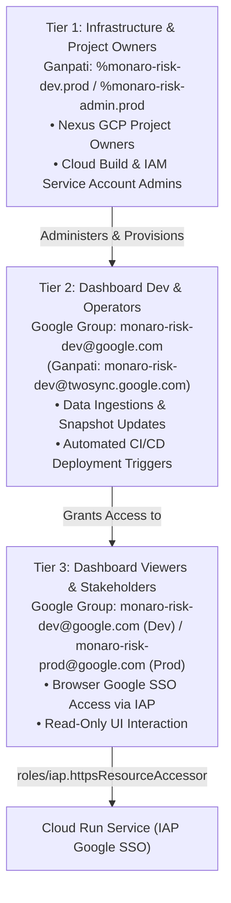

# Project Monaro / F-DSE Risk Governance & Intelligence Platform — Session Resume

**Checkpoint Timestamp:** `2026-08-17 21:42:00 AEST`  
**Active Git Branch:** `dev`  
**Workspace:** `/usr/local/google/home/brendanhills/dev/uk-bh-experiments/project_dash`  
**Live Cloud Run Dev Service:** [https://monaro-risk-dash-dev-525025654699.us-central1.run.app/](https://monaro-risk-dash-dev-525025654699.us-central1.run.app/)  
**Local Cloudtop Dev Server:** [http://uk-bh-cloudtop.c.googlers.com:9000/?project=sample](http://uk-bh-cloudtop.c.googlers.com:9000/?project=sample)  
**Test Suite Health:** **85/85 passing cleanly** (`python3 -m unittest discover tests`).  
**Active Conductor Track:** `decouple_and_gemini_ingestion_20260817` (Status: `[x] Complete`)

---

## 🌅 Tomorrow Morning Quick-Start Checklist

### 1. Verify the Live Deployed Cloud Run Dashboard (30 Seconds)
👉 **[Open Live Deployed Dashboard](https://monaro-risk-dash-dev-525025654699.us-central1.run.app/)**
* Google SSO will authenticate you with your `@google.com` corporate account via Identity-Aware Proxy (IAP).
* Confirm that the 5×5 risk matrix, interactive burndown velocity curves, and podcast audio player load properly.

### 2. Verify Your Group in Pantheon IAP Console
👉 **[Pantheon > Identity-Aware Proxy (IAP) Console](https://pantheon.corp.google.com/security/iap?project=monaro-risk-dev)**
* Select `monaro-risk-dash-dev` under HTTPS Resources.
* Confirm that **`monaro-risk-dev@google.com`** is listed with the role **`IAP-secured Web App User`** (`roles/iap.httpsResourceAccessor`).

### 3. How to Manage Team Access Going Forward
You **never need to touch GCP IAM or Pantheon permissions** to manage team access:
* **To add someone**: Go directly to **[Google Groups > monaro-risk-dev](https://groups.google.com/a/google.com/g/monaro-risk-dev/members)** and click **"Add members"**.
* **To remove someone**: Remove them from the Google Group. IAP instantly revokes their access to the dashboard.
* **Production Group**: **[Google Groups > monaro-risk-prod](https://groups.google.com/a/google.com/g/monaro-risk-prod/members)**.

### 4. Test Local Cloudtop Instance & Project Switcher (Port 9000)
* 👉 **[Open Project Aurora (Public Sample Showcase)](http://uk-bh-cloudtop.c.googlers.com:9000/?project=sample)**
* 👉 **[Open Project F-DSE (Proprietary Live Instance)](http://uk-bh-cloudtop.c.googlers.com:9000/?project=f-dse)**
* Verify the top-bar project badge and 1-click workspace switcher dropdown menu (`Active: Project Aurora ▾`).
* Toggle between **Executive**, **Technical**, and **Governance** tone pills in the Executive Briefing to view dynamic multi-perspective syntheses.

---

## 🎯 Executive Summary of Session Accomplishments

1. **Automated CI/CD Pipeline on Google Cloud Build**:
   - Codified the complete end-to-end automated deployment pipeline in [`deploy/cloudbuild.yaml`](./deploy/cloudbuild.yaml).
   - Configured Cloud Build trigger **`deploy-monaro-risk-dash-dev`** listening to push events on `dev` scoped strictly to `project_dash/**`.
   - Automated 6 sequential pipeline stages: (1) unit testing, (2) Artifact Registry auto-check/create, (3) Docker container build, (4) image push, (5) Cloud Run deploy (`--no-allow-unauthenticated --iap`), and (6) programmatic IAM & IAP policy enforcement.

2. **Zero-Trust Cloud Run Deployment with Native Identity-Aware Proxy (IAP) Google SSO**:
   - Secured Cloud Run behind Identity-Aware Proxy (IAP) with `--no-allow-unauthenticated`.
   - Browser navigation to the service triggers Google corporate SSO, verifying membership against the authorized Google Group allowlist.

3. **Complete Decoupling of Frontend Presentation Engine & Multi-Project Routing**:
   - Stripped all hardcoded static data from `index.html` and implemented dynamic routing via `?project=<slug>`.
   - Isolated public showcase data into `data/sample/` (Project Aurora) and proprietary live data into `data/f-dse/` (Project F-DSE).
   - Created parameterized backend server routes in `server.py` with on-demand `/api/ingest-data` and `/api/regenerate-briefing` endpoints.

4. **Automated Ingestion & 100% Dynamic Client-Side Analytics Engine**:
   - Built `scripts/ingest_data.py` to automatically ingest Google Sheets, Drive PDF reports, and NotebookLM blueprints.
   - Generates structured multi-tone syntheses (Executive, Technical, Governance) and dual-speaker podcast audio scripts.
   - Decommissioned intermediate pre-computation caches in favor of pure, reactive client-side dynamic analytics on raw data files.
   - All 5×5 heatmap matrices, longitudinal burndown curves, and blueprint associations compute dynamically in memory in <3ms.

5. **Test Suite Portability & Environment Agnosticism**:
   - Replaced all workstation-specific absolute paths with dynamic relative paths.
   - Comprehensive test coverage: **85/85 automated unit tests passing cleanly** (`python3 -m unittest discover tests`).

6. **Active Bug Tracking**:
   - Recorded **Bug #59**: *Driver Tree gate deliverable cards related risks links/badges are not clickable* (Status: `Reported` in `.agents/bugs.json`).

---

## 🏛️ 3-Tier Access Hierarchy Mapping



### Ganpati Groups Roster (Namespace: `prod`)
* **`monaro-risk-admin`** (`101368496335`): Root admin and ownership group (`%monaro-risk-admin.prod`).
* **`monaro-risk-dev`** (`101368499563`): Developer and editor access (`monaro-risk-dev@twosync.google.com`).
* **`monaro-risk-prod`** (`101368500273`): Production viewers and stakeholders including `allins@google.com` (`monaro-risk-prod@twosync.google.com`).

---

## 💻 Everyday Developer Workflow

```bash
# 1. Run local automated tests to verify changes
python3 -m unittest discover tests

# 2. Ingest and precompute analytics for target projects
python3 scripts/ingest_data.py --project=sample
python3 scripts/ingest_data.py --project=f-dse

# 3. Stage and commit changes
git add .
git commit -m "feat: description of changes"

# 4. Push to origin/dev to trigger automated Cloud Build CI/CD deployment
git push origin dev
```

---

## 🚀 Replicating to Production (`monaro-risk-prod`) When Ready

1. **Create Production GCP Project via Nexus / C4A IDP** (`go/idp`):
   * Project ID: `monaro-risk-prod`
   * Owner Group: `%monaro-risk-admin.prod`
2. **Provision Cloud Build Trigger**:
   * Create trigger `deploy-monaro-risk-dash-prod` tracking branch `main`.
3. **Configure Production IAP Access**:
   * Bind `monaro-risk-prod@google.com` to `roles/iap.httpsResourceAccessor` on the Cloud Run backend service.
4. **Verify Live Production URL**:
   * Share URL with Allison Innes (`allins@google.com`) and Commonwealth leadership.

---

## 📂 Key Architecture & File References

- **Live Deployed URL:** [https://monaro-risk-dash-dev-525025654699.us-central1.run.app/](https://monaro-risk-dash-dev-525025654699.us-central1.run.app/)
- **IAP Console:** [https://pantheon.corp.google.com/security/iap?project=monaro-risk-dev](https://pantheon.corp.google.com/security/iap?project=monaro-risk-dev)
- **Google Group (Dev):** [https://groups.google.com/a/google.com/g/monaro-risk-dev](https://groups.google.com/a/google.com/g/monaro-risk-dev)
- **Google Group (Prod):** [https://groups.google.com/a/google.com/g/monaro-risk-prod](https://groups.google.com/a/google.com/g/monaro-risk-prod)
- **Cloud Build Console:** [https://pantheon.corp.google.com/cloud-build/builds?project=monaro-risk-dev](https://pantheon.corp.google.com/cloud-build/builds?project=monaro-risk-dev)
- **Cloud Run Console:** [https://pantheon.corp.google.com/run?project=monaro-risk-dev](https://pantheon.corp.google.com/run?project=monaro-risk-dev)
- **Deployment Guide:** [`deploy/DEPLOYMENT_GUIDE.md`](./deploy/DEPLOYMENT_GUIDE.md)
- **CI/CD Pipeline Definition:** [`deploy/cloudbuild.yaml`](./deploy/cloudbuild.yaml)
- **Frontend SPA:** [`index.html`](./index.html)
- **API Server:** [`server.py`](./server.py)
