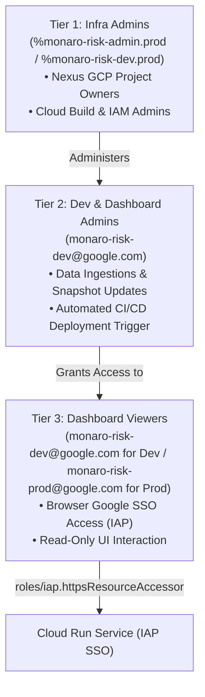

# Project Dash — Session Resume & Compaction Summary

**Checkpoint Timestamp:** `2026-08-17 21:35:00 AEST`  
**Active Git Branch:** `dev`  
**Workspace:** `/usr/local/google/home/brendanhills/dev/uk-bh-experiments/project_dash`  
**Local Cloudtop Dev Server:** `http://uk-bh-cloudtop.c.googlers.com:9000/?project=sample`  
**Live Cloud Run Dev Service:** [https://monaro-risk-dash-dev-525025654699.us-central1.run.app/](https://monaro-risk-dash-dev-525025654699.us-central1.run.app/)  
**Test Suite Health:** **85/85 Passing Cleanly** (`python3 -m unittest discover tests`)  
**Active Conductor Track:** `decouple_and_gemini_ingestion_20260817` marked **COMPLETE** (`[x]`)

---

## 🌅 Tomorrow Morning Quick-Start Checklist

### 1. Test the Local Project Switcher & Dashboards (Local Port 9000)
👉 **[Open Project Aurora (Public Sample Showcase)](http://uk-bh-cloudtop.c.googlers.com:9000/?project=sample)**  
👉 **[Open Project F-DSE (Proprietary Live Instance)](http://uk-bh-cloudtop.c.googlers.com:9000/?project=f-dse)**  
* Verify the top-bar project badge (`PROJECT AURORA` vs `PROJECT F-DSE`) and the 1-click workspace switcher dropdown.
* Click between **Executive**, **Technical**, and **Governance** tone pills in the Executive Briefing to observe dynamic multi-perspective syntheses.
* Verify Top 3 Action cards, Sleeper Outliers, 5×5 heatmap matrices, and burndown velocity charts.

### 2. Verify Google Groups & IAP Team Access Management
👉 **[Pantheon > Identity-Aware Proxy (IAP)](https://pantheon.corp.google.com/security/iap?project=monaro-risk-dev)**  
* **To add/remove team members**: Manage membership directly via Google Groups (zero GCP IAM changes needed):
  * **Dev Access**: **[Google Groups > monaro-risk-dev](https://groups.google.com/a/google.com/g/monaro-risk-dev/members)**
  * **Prod Access**: **[Google Groups > monaro-risk-prod](https://groups.google.com/a/google.com/g/monaro-risk-prod/members)**
* Verify that **`monaro-risk-dev@google.com`** is listed under **IAP-secured Web App User** (`roles/iap.httpsResourceAccessor`).

### 3. Review Recorded Bugs & Next Tasks
* **Bug #59**: *Driver Tree gate deliverable cards related risks links/badges are not clickable* (Status: `Reported`).
  * Run `/triage_bug #59` or `/fix_bug #59` when ready to address.

---

## 👥 Google Groups & Ganpati Access Control Roster

### 1. Ganpati Groups Roster (Namespace: `prod`)
* **`monaro-risk-admin`** (`101368496335`): Root admin and ownership group (`%monaro-risk-admin.prod`).
* **`monaro-risk-dev`** (`101368499563`): Developer and editor access (`monaro-risk-dev@twosync.google.com`).
* **`monaro-risk-prod`** (`101368500273`): Production viewers and stakeholders including `allins@google.com` (`monaro-risk-prod@twosync.google.com`).

### 2. 3-Tier Access Hierarchy Mapping


### 3. Google Groups & Cloud Build Tasks
- [x] **Automated CI/CD Pipeline on Google Cloud Build**: Codified in [`deploy/cloudbuild.yaml`](./deploy/cloudbuild.yaml) with trigger `deploy-monaro-risk-dash-dev`.
- [x] **Zero-Trust Security & Identity-Aware Proxy (IAP) Google SSO**: Secured Cloud Run behind Identity-Aware Proxy with automatic IAM binding.
- [ ] **Production Rollout (`monaro-risk-prod`)**:
  - Replicate Cloud Run service configuration to production project `monaro-risk-prod`.
  - Bind `monaro-risk-prod@google.com` to `roles/iap.httpsResourceAccessor`.
  - Verify live production URL with Allison Innes (`allins@google.com`) and program stakeholders.

---

## 🎯 Executive Summary of Session Accomplishments

1. **Complete Decoupling of Frontend Engine from Project Content (Phases 1–4)**:
   - Extracted all proprietary registers, blueprints, and snapshots into isolated `data/sample/` (Project Aurora) and `data/f-dse/` (Project F-DSE) directories.
   - Refactored `index.html` to dynamically load `config.json`, `risks.json`, `issues.json`, `snapshots.json`, `driver_tree.json`, `knowledge.json`, and `precomputed_analytics.json` based on `?project=<slug>`.
   - Added persistent top-bar project branding badge and a quick-switcher dropdown menu.

2. **Distinct Multi-Tone AI Executive Briefings**:
   - Enriched both `data/sample/snapshots.json` and `data/f-dse/snapshots.json` with tailored, rich multi-perspective syntheses (Executive, Technical, Governance), Top 3 action items, and Sleeper Outliers across all historical weeks.
   - Decoupled NotebookLM links, knowledge base sources, and dual-host neural podcast players.

3. **Backend Server Parameterization & On-Demand APIs (Phase 5)**:
   - Parameterized `server.py` to route all endpoints (`/api/sync-sheet`, `/api/check-drive-sync`, `/api/notebooks`, `/api/check-notebook-sync`) dynamically via `?project=<slug>` or `.env` defaults.
   - Added `POST /api/ingest-data` to trigger project ingestion on demand.
   - Added `POST /api/regenerate-briefing` to invoke Gemini 3.5 live on-demand synthesis regeneration.
   - Created comprehensive unit test suite `tests/test_server_parameterized.py`.

4. **Repository Sanitization & Open-Source Readiness (Phase 6)**:
   - Configured strict `.gitignore` rules to exclude secrets (`.env*`), private data (`data/f-dse/`, `data/local/`), and private audio while preserving the public showcase (`data/sample/`).
   - Created `.env.example` documenting Vertex AI Application Default Credentials (ADC), `GEMINI_API_KEY`, models, and project defaults.
   - Rewrote open-source [`README.md`](./README.md) with quickstart guides, multi-project directory isolation, and automated Gemini ingestion instructions.

5. **Bug Reporting Protocol**:
   - Recorded Bug #59 into `.agents/bugs.json` per protocol without premature code modification.

---

## 📂 Key Architecture & File References

- **Frontend Application:** [`index.html`](./index.html)
- **Local Runner & API Server:** [`server.py`](./server.py) / [`run_server.sh`](./run_server.sh)
- **Deployment Guide:** [`deploy/DEPLOYMENT_GUIDE.md`](./deploy/DEPLOYMENT_GUIDE.md)
- **CI/CD Pipeline Definition:** [`deploy/cloudbuild.yaml`](./deploy/cloudbuild.yaml)
- **Live Service URL:** [https://monaro-risk-dash-dev-525025654699.us-central1.run.app/](https://monaro-risk-dash-dev-525025654699.us-central1.run.app/)
- **Google Group (Dev):** [https://groups.google.com/a/google.com/g/monaro-risk-dev](https://groups.google.com/a/google.com/g/monaro-risk-dev)
- **Google Group (Prod):** [https://groups.google.com/a/google.com/g/monaro-risk-prod](https://groups.google.com/a/google.com/g/monaro-risk-prod)
- **Cloud Build Console:** [https://pantheon.corp.google.com/cloud-build/builds?project=monaro-risk-dev](https://pantheon.corp.google.com/cloud-build/builds?project=monaro-risk-dev)
- **Cloud Run Console:** [https://pantheon.corp.google.com/run?project=monaro-risk-dev](https://pantheon.corp.google.com/run?project=monaro-risk-dev)

---

## 🧪 Verification & Test Suite Status

```bash
# Run full automated test suite
python3 -m unittest discover tests
# Result: Ran 85 tests in 4.35s -> OK (100% Passing)

# Validate JavaScript syntax
node -c index.html extracted script blocks -> OK (0 Syntax Errors)
```
