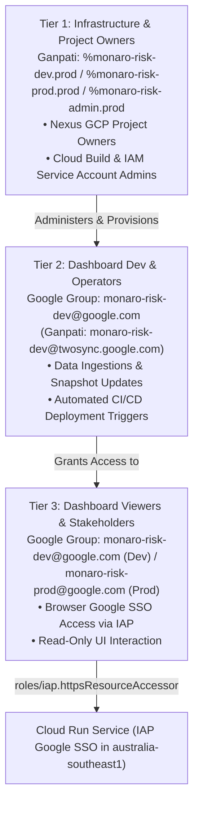

# Project Monaro / F-DSE Risk Governance & Intelligence Platform — Session Resume

**Checkpoint Timestamp:** `2026-08-20 15:20:00 AEST`  
**Active Git Branch:** `dev`  
**Workspace:** `/usr/local/google/home/brendanhills/dev/uk-bh-experiments/project_dash`  
**Deployment Region:** **`australia-southeast1`** (Sydney, Australia)  
**Live Cloud Run Dev Service:** `monaro-risk-dash-dev`  
**Live Cloud Run Prod Service:** `monaro-risk-dash-prod`  
**Local Cloudtop Dev Server:** [http://uk-bh-cloudtop.c.googlers.com:9000/?project=sample](http://uk-bh-cloudtop.c.googlers.com:9000/?project=sample)  
**Test Suite Health:** **103/103 passing cleanly** (`python3 -m unittest discover -s tests -p "test_*.py"`).  
**Active Conductor Track:** `modularize_frontend_architecture_20260818` (Status: `[ ] Planned`)

---

## 🌅 Quick-Start Verification Checklist

### 1. Verify Cloud Build Status & Health via CLI Tool
```bash
# Check latest build in Australia region (Dev)
python3 scripts/check_build_status.py --env dev

# Check latest build in Australia region (Prod)
python3 scripts/check_build_status.py --env prod
```

### 2. Verify Access Groups in Google Groups
* **Dev Group**: **[Google Groups > monaro-risk-dev](https://groups.google.com/a/google.com/g/monaro-risk-dev/members)**
* **Prod Group**: **[Google Groups > monaro-risk-prod](https://groups.google.com/a/google.com/g/monaro-risk-prod/members)**

### 3. How to Deploy to Production (Release Tag on `dev`)
```bash
# 1. Create a production release tag on the dev branch
git tag project_dash/prod-v1.0.0

# 2. Push tag to GitHub
git push origin project_dash/prod-v1.0.0
```

### 4. How End Users Sync Live Data in the Dashboard (Hands-Free)
* Open the dashboard in browser.
* Click **"Sync Workspace"** $\rightarrow$ **"Sync Live Data Now"**.
* The Cloud Run backend (`/api/sync-all`) ingests Google Sheets and Drive PDF reports on the fly with zero code redeployments.

---

## 🎯 Executive Summary of Session Accomplishments

1. **Australia Region (`australia-southeast1`) Migration**:
   - Updated [`deploy/cloudbuild.yaml`](./deploy/cloudbuild.yaml) to provision Artifact Registry and deploy Cloud Run in Sydney, Australia (`australia-southeast1`).
2. **Production Environment (`monaro-risk-prod`) Architecture**:
   - Standardized production naming: `monaro-risk-dash-prod`.
   - Built [`deploy/PROD_PROVISIONING_GUIDE.md`](./deploy/PROD_PROVISIONING_GUIDE.md) providing complete copy-paste shell scripts for enabling 11 GCP APIs, creating service accounts, binding least-privilege IAM roles, and configuring Cloud Build tag triggers.
3. **Monorepo Tag-Driven Production CI/CD Trigger**:
   - Production deployments trigger automatically when tags matching `^project_dash/prod-.*$` (e.g. `project_dash/prod-v1.0.0`) are pushed on `dev`.
   - Preserves continuous iteration on `dev` without unwanted production builds on normal commits or checkpoint tags.
4. **Universal In-Dashboard Data Sync Backend**:
   - Added `/api/sync-all` to `server.py` to allow live browser-triggered sync of Google Sheets, Drive PDF reports, and Gemini briefings.
5. **Multi-Environment Diagnostics Tool**:
   - Upgraded `scripts/check_build_status.py` to support `--env dev` / `--env prod` and default to `australia-southeast1`.
6. **Test Suite Health**:
   - **103/103 automated unit tests passing cleanly** (`python3 -m unittest discover -s tests -p "test_*.py"`).

---

## 🏛️ 3-Tier Access Hierarchy Mapping



---

## 💻 Everyday Developer Workflow

```bash
# 1. Run local automated tests to verify changes
python3 -m unittest discover -s tests -p "test_*.py"

# 2. Stage and commit changes on dev
git add .
git commit -m "feat: description of changes"

# 3. Push to origin/dev to trigger automated Dev deployment (Sydney)
git push origin dev

# 4. When ready for a production release, tag on dev
git tag project_dash/prod-v1.0.0
git push origin project_dash/prod-v1.0.0
```

---

## 📂 Key Architecture & File References

- **IAP Console (Dev):** [https://pantheon.corp.google.com/security/iap?project=monaro-risk-dev](https://pantheon.corp.google.com/security/iap?project=monaro-risk-dev)
- **IAP Console (Prod):** [https://pantheon.corp.google.com/security/iap?project=monaro-risk-prod](https://pantheon.corp.google.com/security/iap?project=monaro-risk-prod)
- **Google Group (Dev):** [https://groups.google.com/a/google.com/g/monaro-risk-dev](https://groups.google.com/a/google.com/g/monaro-risk-dev)
- **Google Group (Prod):** [https://groups.google.com/a/google.com/g/monaro-risk-prod](https://groups.google.com/a/google.com/g/monaro-risk-prod)
- **Production Provisioning Guide:** [`deploy/PROD_PROVISIONING_GUIDE.md`](./deploy/PROD_PROVISIONING_GUIDE.md)
- **CI/CD Pipeline Definition:** [`deploy/cloudbuild.yaml`](./deploy/cloudbuild.yaml)
- **Build Status Tool:** [`scripts/check_build_status.py`](./scripts/check_build_status.py)
- **API Server & Sync Handler:** [`server.py`](./server.py)
