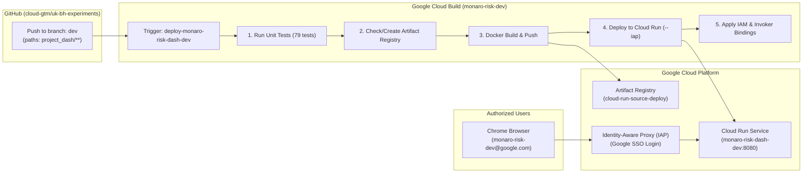

# 🚀 Project Monaro Risk Dashboard — Automated CI/CD Deployment Guide

This guide documents the end-to-end, reproducible deployment procedure for the **Project Monaro Risk Dashboard** on **Google Cloud Run**, automated via **Google Cloud Build** triggers on GitHub push events, and secured with **Identity-Aware Proxy (IAP)** for seamless corporate Google SSO authentication.

All steps below reflect the streamlined, verified setup, with all exploratory troubleshooting, permission gaps, and repository linking quirks resolved.

---

## 🏗️ Architecture & Security Model



### Environment Mapping

| Environment | GCP Project ID | Git Branch | Cloud Run Service Name | Cloud Build Trigger Name | Access Control Group |
| :--- | :--- | :--- | :--- | :--- | :--- |
| **Development** | `monaro-risk-dev` | `dev` | `monaro-risk-dash-dev` | `deploy-monaro-risk-dash-dev` | `monaro-risk-dev@google.com` |
| **Production** | `monaro-risk-prod` | `main` | `monaro-risk-dash` | `deploy-monaro-risk-dash-prod` | `monaro-risk-prod@google.com` |

---

## 📋 Step 1: GCP Project Initialization & APIs

Enable all required Google Cloud APIs for container building, hosting, logging, and access proxying:

```bash
gcloud services enable \
    run.googleapis.com \
    cloudbuild.googleapis.com \
    artifactregistry.googleapis.com \
    iap.googleapis.com \
    cloudresourcemanager.googleapis.com \
    --project="monaro-risk-dev"
```

---

## 👤 Step 2: Dedicated Service Account Setup

Cloud Build runs under a dedicated, least-privilege Service Account to perform builds, manage Artifact Registry images, deploy Cloud Run services, and write build logs.

### 1. Create the Service Account:
```bash
gcloud iam service-accounts create github-deployer \
    --description="Cloud Build trigger execution service account" \
    --display-name="GitHub Deployer" \
    --project="monaro-risk-dev"
```

### 2. Grant Required IAM Roles:
Assign the exact set of required roles to `github-deployer@monaro-risk-dev.iam.gserviceaccount.com`:

```bash
SA_EMAIL="github-deployer@monaro-risk-dev.iam.gserviceaccount.com"
PROJECT_ID="monaro-risk-dev"

# Cloud Run deployment and management
gcloud projects add-iam-policy-binding $PROJECT_ID \
    --member="serviceAccount:$SA_EMAIL" \
    --role="roles/run.admin"

# Artifact Registry image pushing and creation
gcloud projects add-iam-policy-binding $PROJECT_ID \
    --member="serviceAccount:$SA_EMAIL" \
    --role="roles/artifactregistry.admin"

# Act as the runtime service identity
gcloud projects add-iam-policy-binding $PROJECT_ID \
    --member="serviceAccount:$SA_EMAIL" \
    --role="roles/iam.serviceAccountUser"

# Write build execution logs to Cloud Logging
gcloud projects add-iam-policy-binding $PROJECT_ID \
    --member="serviceAccount:$SA_EMAIL" \
    --role="roles/logging.logWriter"

# Manage IAP configurations
gcloud projects add-iam-policy-binding $PROJECT_ID \
    --member="serviceAccount:$SA_EMAIL" \
    --role="roles/iap.admin"
```

---

## 🔗 Step 3: Connect GitHub to Google Cloud Build

> [!NOTE]
> Use standard **Cloud Build Repositories (GitHub App)** rather than Developer Connect to avoid cross-organization OAuth redirection errors.

1. In Pantheon, open **[Cloud Build > Repositories (1st gen)](https://pantheon.corp.google.com/cloud-build/repositories/1st-gen?project=monaro-risk-dev)**.
2. Click **"CONNECT REPOSITORY"**.
3. Select source: **GitHub (Cloud Build GitHub App)**.
4. Authorize Google Cloud Build to access your GitHub organization/account (`cloud-gtm`).
5. Select repository: **`cloud-gtm/uk-bh-experiments`**.
6. Check the box agreeing to terms and click **"Connect"**.

---

## ⚡ Step 4: Create the Automated Cloud Build Trigger

Create a trigger that runs automated tests and deploys whenever files inside `project_dash/**` are pushed to the `dev` branch:

1. Open **[Cloud Build > Triggers](https://pantheon.corp.google.com/cloud-build/triggers?project=monaro-risk-dev)**.
2. Click **"CREATE TRIGGER"**.
3. Configure the trigger settings:
   * **Name**: `deploy-monaro-risk-dash-dev`
   * **Region**: `global` (or `us-central1`)
   * **Event**: `Push to a branch`
   * **Source**:
     * **Repository**: `cloud-gtm/uk-bh-experiments (github)`
     * **Branch**: `^dev$`
   * **Included files filter (glob)**:
     ```
     project_dash/**
     ```
   * **Configuration**:
     * **Type**: `Cloud Build configuration file (yaml or json)`
     * **Location**: `Repository`
     * **Cloud Build configuration file location**: `project_dash/deploy/cloudbuild.yaml`
   * **Advanced > Service Account**:
     * Select `github-deployer@monaro-risk-dev.iam.gserviceaccount.com`
4. Click **"Create"**.

---

## 📦 Step 5: The Automated CI/CD Pipeline (`cloudbuild.yaml`)

The pipeline definition is stored in [`project_dash/deploy/cloudbuild.yaml`](file:///usr/local/google/home/brendanhills/dev/uk-bh-experiments/project_dash/deploy/cloudbuild.yaml). It executes 6 sequential stages:

```yaml
steps:
  # 1. Run Automated Unit & Ingestion Tests
  - name: 'python:3.13-slim'
    dir: 'project_dash'
    entrypoint: 'bash'
    args:
      - '-c'
      - |
        pip install --no-cache-dir -r requirements.txt
        python3 -m unittest discover -s tests -p "test_*.py"

  # 2. Ensure Artifact Registry repository exists (Idempotent)
  - name: 'gcr.io/google.com/cloudsdktool/cloud-sdk'
    entrypoint: 'bash'
    args:
      - '-c'
      - |
        gcloud artifacts repositories describe cloud-run-source-deploy --location=us-central1 --project=$PROJECT_ID || \
        gcloud artifacts repositories create cloud-run-source-deploy --repository-format=docker --location=us-central1 --description="Cloud Run source deployments" --project=$PROJECT_ID

  # 3. Build Container Image using Custom Multi-Stage Dockerfile
  - name: 'gcr.io/cloud-builders/docker'
    dir: 'project_dash'
    args:
      - 'build'
      - '-f'
      - 'deploy/Dockerfile'
      - '-t'
      - 'us-central1-docker.pkg.dev/$PROJECT_ID/cloud-run-source-deploy/monaro-risk-dash-dev:$COMMIT_SHA'
      - '-t'
      - 'us-central1-docker.pkg.dev/$PROJECT_ID/cloud-run-source-deploy/monaro-risk-dash-dev:latest'
      - '.'

  # 4. Push Container Image to Artifact Registry
  - name: 'gcr.io/cloud-builders/docker'
    args:
      - 'push'
      - 'us-central1-docker.pkg.dev/$PROJECT_ID/cloud-run-source-deploy/monaro-risk-dash-dev:$COMMIT_SHA'

  # 5. Deploy to Cloud Run (Private Mode + Native IAP Enabled)
  - name: 'gcr.io/google.com/cloudsdktool/cloud-sdk'
    entrypoint: 'gcloud'
    args:
      - 'run'
      - 'deploy'
      - 'monaro-risk-dash-dev'
      - '--image'
      - 'us-central1-docker.pkg.dev/$PROJECT_ID/cloud-run-source-deploy/monaro-risk-dash-dev:$COMMIT_SHA'
      - '--region'
      - 'us-central1'
      - '--platform'
      - 'managed'
      - '--no-allow-unauthenticated'
      - '--iap'
      - '--port'
      - '8080'

  # 6. Enforce IAM Invoker Policies (IAP + Allowlisted Groups)
  - name: 'gcr.io/google.com/cloudsdktool/cloud-sdk'
    entrypoint: 'bash'
    args:
      - '-c'
      - |
        # Grant Cloud Run Invoker to IAP Service Agent
        gcloud run services add-iam-policy-binding monaro-risk-dash-dev \
          --project=$PROJECT_ID \
          --region=us-central1 \
          --member="serviceAccount:service-$PROJECT_NUMBER@gcp-sa-iap.iam.gserviceaccount.com" \
          --role="roles/run.invoker" || true

        # Grant direct Cloud Run Invoker to Google Group and TwoSync group
        gcloud run services add-iam-policy-binding monaro-risk-dash-dev \
          --project=$PROJECT_ID \
          --region=us-central1 \
          --member="group:monaro-risk-dev@google.com" \
          --role="roles/run.invoker" || true

        gcloud run services add-iam-policy-binding monaro-risk-dash-dev \
          --project=$PROJECT_ID \
          --region=us-central1 \
          --member="group:monaro-risk-dev@twosync.google.com" \
          --role="roles/run.invoker" || true

        gcloud run services add-iam-policy-binding monaro-risk-dash-dev \
          --project=$PROJECT_ID \
          --region=us-central1 \
          --member="user:brendanhills@google.com" \
          --role="roles/run.invoker"

        gcloud run services add-iam-policy-binding monaro-risk-dash-dev \
          --project=$PROJECT_ID \
          --region=us-central1 \
          --member="user:allins@google.com" \
          --role="roles/run.invoker"

images:
  - 'us-central1-docker.pkg.dev/$PROJECT_ID/cloud-run-source-deploy/monaro-risk-dash-dev:$COMMIT_SHA'
  - 'us-central1-docker.pkg.dev/$PROJECT_ID/cloud-run-source-deploy/monaro-risk-dash-dev:latest'

options:
  logging: CLOUD_LOGGING_ONLY
```

---

## 🛡️ Step 6: Granting Browser SSO Access (IAP)

Cloud Run uses **Identity-Aware Proxy (IAP)** to allow corporate users to log in with their Google accounts directly in the browser:

1. Open **[Pantheon > Security > Identity-Aware Proxy](https://pantheon.corp.google.com/security/iap?project=monaro-risk-dev)**.
2. Select the resource: **`monaro-risk-dash-dev`** (under Cloud Run services).
3. On the right-side info panel, click **"ADD PRINCIPAL"**.
4. Configure access:
   * **New principals**:
     * `monaro-risk-dev@google.com` *(Google Group)*
     * `brendanhills@google.com` *(Individual fallback)*
     * `allins@google.com` *(Individual fallback)*
   * **Role**: **`IAP-secured Web App User`** (`roles/iap.httpsResourceAccessor`)
5. Click **"Save"**.

---

## 🚀 Step 7: Everyday Developer Workflow

Once configured, deployment is completely hands-free:

```bash
# 1. Edit code or data files under project_dash/
# 2. Run local unit tests to verify
python3 -m unittest discover -s project_dash/tests -p "test_*.py"

# 3. Commit and push to the dev branch
git add project_dash/
git commit -m "feat: update risk dashboard calculations and UI layout"
git push origin dev
```

Cloud Build automatically triggers, executes the test suite, builds the container image, deploys to Cloud Run, and updates IAM permissions.

* 👉 **Track Build Status**: [Cloud Build History](https://pantheon.corp.google.com/cloud-build/builds?project=monaro-risk-dev)
* 👉 **Access Dashboard**: [Live Service URL](https://monaro-risk-dash-dev-525025654699.us-central1.run.app/)

---

## 🔧 Production Replication (`monaro-risk-prod`)

To onboard the production environment, follow the exact same steps substituting:
* **GCP Project**: `monaro-risk-prod`
* **Git Branch**: `main`
* **Cloud Run Service**: `monaro-risk-dash`
* **Trigger Name**: `deploy-monaro-risk-dash-prod`
* **Access Group**: `monaro-risk-prod@google.com`

---

## 💡 Troubleshooting & Common Gotchas Resolved

| Issue Encountered | Root Cause | Permanent Resolution |
| :--- | :--- | :--- |
| **`FileNotFoundError` during Cloud Build tests** | Tests had hardcoded Cloudtop absolute paths (`/usr/local/google/...`). | Replaced with dynamic relative paths `os.path.join(os.path.dirname(__file__), "..", ...)`. |
| **`FileNotFoundError: 'node'` during build** | `test_presentation_decoupling.py` assumed `node` binary was installed on worker. | Made `node` execution conditional on `shutil.which('node')`. |
| **`Repository "cloud-run-source-deploy" not found`** | Artifact Registry repository must be initialized before `docker push`. | Added Step 2 in `cloudbuild.yaml` to auto-check/create repo idempotently. |
| **Missing `roles/logging.logWriter`** | Custom Service Account lacked permission to write build logs. | Granted `roles/logging.logWriter` to `github-deployer@...`. |
| **`403 Forbidden` on `.run.app` in browser** | `--no-allow-unauthenticated` rejects browser requests lacking OIDC token. | Enabled `--iap` on Cloud Run and granted `roles/iap.httpsResourceAccessor`. |
| **IAP Principal Red Warning on New Group** | Newly created Google Groups take 5–10 mins to replicate into Cloud Identity directory. | Allow 5–10 mins for group propagation or use direct `@google.com` LDAP accounts as immediate fallback. |
