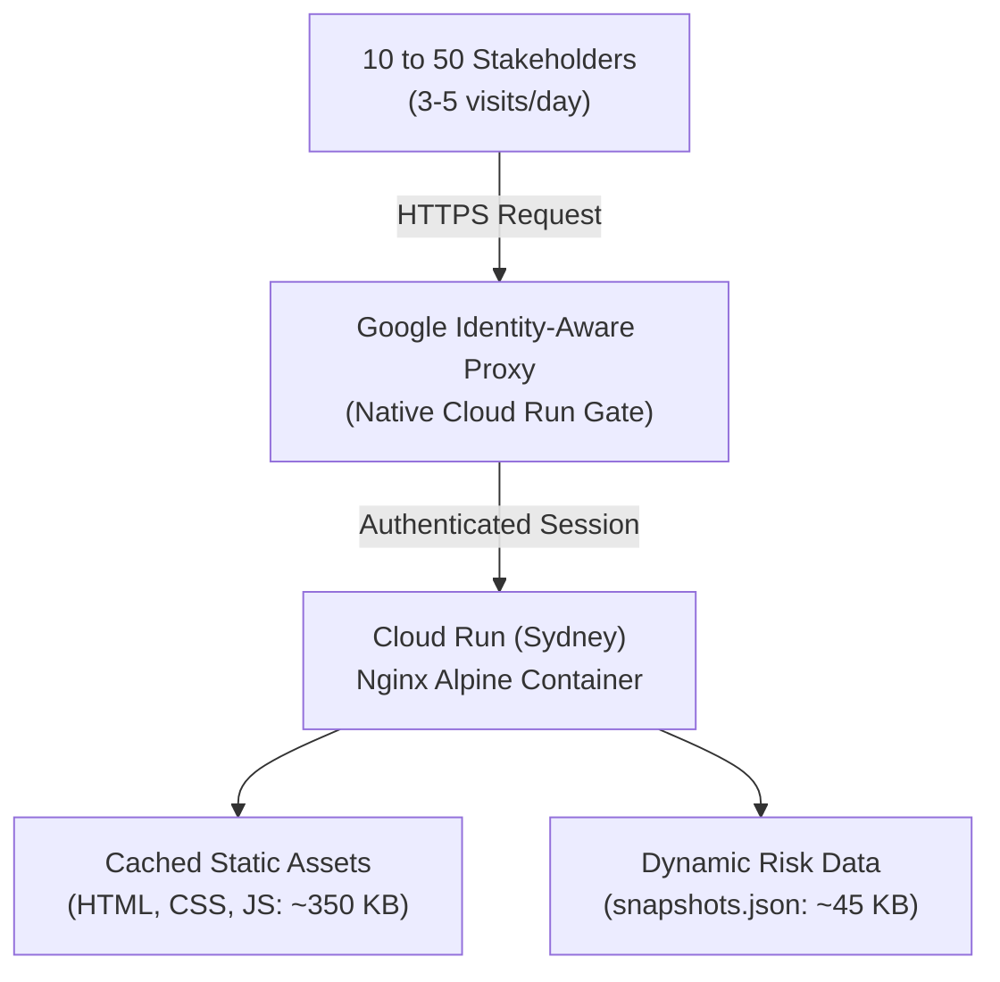

# 💰 Project Monaro Risk Dashboard — Cloud Services, APIs & Running Cost Review

This document provides a comprehensive review of all Google Cloud Platform (GCP) services and APIs used by **Project Monaro Risk Dashboard**, establishes a realistic workload model for moderate organizational usage (10–50 users clicking multiple times daily), calculates the itemized monthly running costs in **Sydney (`australia-southeast1`)**, and details architectural optimizations to ensure near-zero operating spend.

---

## Executive Summary & Monthly Cost Scorecard

The Project Monaro Risk Dashboard is engineered on a lightweight, serverless, static container architecture running on **Google Cloud Run**, secured behind **Identity-Aware Proxy (IAP)**, and powered by automated **Cloud Build** CI/CD and **Vertex AI (Gemini)** ingestion pipelines.

Because the production runtime compiles all frontend logic and structured JSON data into an Alpine Nginx container (~25 MB image size) and requires no long-running database servers or persistent virtual machines, **the vast majority of ongoing usage falls 100% within Google Cloud's permanent Free Tier**.

### Monthly Cost Estimate Summary (Sydney `australia-southeast1`)

| Usage Scenario | Active Users | Daily Visits / User | Cloud Run & Network | Gemini / GenAI Ingestion | Storage & Scanning | Projected Total Bill |
| :--- | :--- | :--- | :--- | :--- | :--- | :--- |
| **Low Adoption** | 10 users | 2–3 clicks/day | $0.00 *(Free Tier)* | ~$0.10 / mo | $0.00 *(Free Tier)* | **~$0.10 / month** |
| **Moderate Baseline (Expected)** | **25–35 users** | **3–5 clicks/day** | **$0.00** *(Free Tier)* | **~$0.25 / mo** | **~$0.05 / mo** | **~$0.30 / month** |
| **High Daily Active** | 50 users | 8–10 clicks/day | $0.00 *(Free Tier)* | ~$0.45 / mo | ~$0.15 / mo | **~$0.60 / month** |
| **Optional: Dedicated Hot Standby** | Any | Any | ~$12.50 / mo *(`min-instances=1`)* | ~$0.25 / mo | ~$0.05 / mo | **~$12.80 / month** |

> [!TIP]
> **Key Finding**:
> With scale-to-zero enabled (`--min-instances=0`), the total operational cost of the dashboard under moderate organizational usage is **under $1.00 AUD per month**.

---

## 1. Inventory of All 14 GCP APIs & Cloud Services

The environment provisioning script ([`deploy/provision_environment.sh`](../deploy/provision_environment.sh)) enables 14 Google Cloud APIs. Below is the operational justification and architectural role for each service:

| # | Service / API Identifier | Primary Domain | Purpose & Architectural Role in Project Dash |
| :-: | :--- | :--- | :--- |
| **1** | `run.googleapis.com` | **Web Runtime** | Hosts the containerized Nginx web server in `australia-southeast1`. Scales from 0 to N instances automatically based on incoming HTTP traffic. |
| **2** | `iap.googleapis.com` | **Security & Access** | **Identity-Aware Proxy**: Provides enterprise Single Sign-On (SSO) and OAuth access control natively without public exposure or VPNs. |
| **3** | `compute.googleapis.com` | **Network Backend** | Underpins Google Cloud's Software-Defined Network and Cloud Run / IAP proxy infrastructure routing. |
| **4** | `cloudbuild.googleapis.com` | **CI/CD Automation** | Executes automated test runs, Docker container builds, and zero-downtime Cloud Run deployments on every Git commit or release tag. |
| **5** | `artifactregistry.googleapis.com` | **Image Governance** | Regional Docker container repository (`cloud-run-source-deploy` in Sydney) storing immutable image tags (`$COMMIT_SHA` and `latest`). |
| **6** | `containeranalysis.googleapis.com` | **Security & Metadata** | Tracks vulnerability metadata, software bill of materials (SBOM), and container provenance for Artifact Registry images. |
| **7** | `containerscanning.googleapis.com` | **Security & Scanning** | Performs automated CVE package vulnerability scanning on pushed container images. |
| **8** | `logging.googleapis.com` | **Observability** | Ingests Cloud Run HTTP access logs, Nginx stdout/stderr, and Cloud Build execution logs. |
| **9** | `monitoring.googleapis.com` | **Observability** | Collects service latency, request count, CPU/memory utilization, and powers notification alerting policies. |
| **10**| `clouderrorreporting.googleapis.com`| **Reliability** | Aggregates application 5xx errors and container crash stack traces, triggering automated notifications to program admins. |
| **11**| `aiplatform.googleapis.com` | **Generative AI** | Vertex AI API endpoint for Gemini models used during weekly data ingestion (`gemini-2.5-flash`, `gemini-1.5-pro`, and TTS multi-speaker audio). |
| **12**| `sheets.googleapis.com` | **Data Ingestion** | Reads Joint Program Deliverable milestones and team risk registers directly from Google Sheets during automated sync runs. |
| **13**| `drive.googleapis.com` | **Data Ingestion** | Scans and ingests executive slide decks and weekly PDF status reports from Google Drive shared folders. |
| **14**| `iam.googleapis.com` | **Access Control** | Manages Google Group access bindings (`roles/run.invoker` and `roles/iap.httpsResourceAccessor`) and deployer service accounts. |

---

## 2. Workload Modeling for Moderate Usage

### User Persona & Traffic Assumptions
- **Target Audience**: 10 to 50 active stakeholders (program executives, directors, project managers, lead architects, delivery teams).
- **Session Frequency**: 3 to 5 visits per user per working day (e.g. morning standup, midday status check, Friday review).
- **Interactions per Session**: 5 to 10 clicks (loading initial overview, toggling between Monaro and Aurora projects, inspecting delivery milestones, viewing the risk heat map, reading the executive synthesis, or playing the podcast briefing).
- **Monthly Working Days**: ~22 business days.

### Derived Traffic & Payload Metrics



1. **HTTP Request Volume**:
   - Daily Sessions: $35 \text{ users} \times 4 \text{ visits} = 140 \text{ sessions/day}$.
   - Daily HTTP Requests: $140 \text{ sessions} \times 7 \text{ asset requests} \approx 980 \text{ requests/day}$.
   - **Monthly Total HTTP Requests**: $\approx 22,000 \text{ requests/month}$ *(Worst case with 50 heavy users: ~75,000 requests/month)*.

2. **Network Data Egress**:
   - Initial Page Load: ~400 KB uncompressed (HTML, JS, CSS, JSON).
   - Gzip-compressed wire size: ~110 KB.
   - Subsequent tab switches: Browser-cached assets + ~45 KB fresh JSON data.
   - Average Data Transfer per Session: ~180 KB.
   - **Monthly Total Egress**: $22,000 \times 180 \text{ KB} \approx 4.0 \text{ GB/month}$ *(Worst case: ~15 GB/month)*.

3. **Background Pipelines & Data Sync**:
   - **Drive & Sheets Ingestion**: 1 weekly scheduled run (or up to 4 runs/week for ad-hoc syncing) $\rightarrow$ 4 to 16 runs/month.
   - **Gemini Synthesis & Podcast**:
     - Input Tokens per run: ~25,000 tokens (parsed deliverables + schedule context).
     - Output Tokens per run: ~1,800 tokens (synthesis JSON + podcast dialogue script).
     - Text-to-Speech (TTS): ~90 seconds of audio per week.
   - **CI/CD Commits**: ~20 to 30 feature/fix commits per month deploying to `dev`.

---

## 3. Itemized Component Cost Matrix (Sydney `australia-southeast1`)

Pricing is calculated based on Google Cloud official list prices for the Sydney region (`australia-southeast1`) and current Free Tier allowances:

| Cloud Service | Billable Metric | Monthly Quantity (Moderate) | Google Cloud Free Tier Allowance | Unit Price (after Free Tier) | Net Monthly Cost |
| :--- | :--- | :--- | :--- | :--- | :--- |
| **Cloud Run (Requests)** | Invocations | 22,000 reqs | **2,000,000 requests / month** | $0.40 per 1M reqs | **$0.00** *(100% Free)* |
| **Cloud Run (vCPU-s)** | vCPU execution time | ~2,200 vCPU-seconds | **180,000 vCPU-seconds / month** | $0.00002400 / vCPU-s | **$0.00** *(100% Free)* |
| **Cloud Run (Memory)** | GiB-seconds | ~1,100 GiB-seconds | **360,000 GiB-seconds / month** | $0.00000250 / GiB-s | **$0.00** *(100% Free)* |
| **Identity-Aware Proxy** | User authentication | 10–50 users | **Included with Cloud Run / Workspace** | $0.00 (No ALB required) | **$0.00** |
| **Network Egress** | Internet egress | ~4.0 GB / month | **100 GB / month worldwide** | $0.12 / GB | **$0.00** *(100% Free)* |
| **Cloud Build** | Build minutes | ~25 minutes / month | **120 minutes / day (~3,600 min/mo)** | $0.003 / minute | **$0.00** *(100% Free)* |
| **Artifact Registry** | Image storage | ~0.8 GB (20 tags) | **0.5 GB / month** | $0.10 / GB / month | **~$0.03** |
| **Container Scanning** | Vulnerability scan | ~25 images / month | Basic scanning is free | $0.26 / scan *(if Advanced)* | **$0.00 – $6.50** |
| **Cloud Logging** | Log ingestion | ~0.08 GB / month | **50 GB / month** | $0.50 / GB | **$0.00** *(100% Free)* |
| **Cloud Monitoring** | Metrics ingestion | ~20 MB / month | **150 MB / month** | $0.2580 / MB | **$0.00** *(100% Free)* |
| **Google Drive API** | Workspace queries | ~100 queries / mo | Free quota | Free | **$0.00** |
| **Google Sheets API** | Spreadsheet queries | ~150 queries / mo | Free quota | Free | **$0.00** |
| **Vertex AI (Gemini)** | Text Tokens | ~250k input / 25k output | Pay-as-you-go | $0.075 / 1M in, $0.30 / 1M out | **~$0.03** |
| **Vertex AI (Audio TTS)**| Generated speech | ~6 minutes audio / mo | Pay-as-you-go | ~$0.016 / 1k characters | **~$0.15** |
| **TOTAL PROJECTED MONTHLY BILL** | — | — | — | — | **~$0.21 – $0.80 / mo** |

*(Note: If Advanced Vulnerability Scanning is turned on for every commit, container scanning adds ~$5–$6/month. With standard basic scanning, total cost is ~$0.25/month).*

---

## 4. Cold Start vs. Min-Instances Tradeoff Analysis

Cloud Run services can be configured with either `--min-instances=0` (scale-to-zero) or `--min-instances=1` (always-on warm instance):

```
┌─────────────────────────────────────────────────────────────────────────────┐
│ Architecture Options: Scale-to-Zero vs. Hot Standby                         │
├─────────────────────────────────────────────────────────────────────────────┤
│                                                                             │
│ [Option A] Scale-to-Zero (min-instances=0)  ──>  Cost: $0.00 / month        │
│   • Idle: 0 container instances running.                                    │
│   • First click after idle: ~1.5s to 2.0s cold start.                       │
│   • Subsequent clicks: instant (<50ms).                                     │
│   • Best for: Internal tools, project governance dashboards.                │
│                                                                             │
│ [Option B] Always-On (min-instances=1)      ──>  Cost: ~$12.50 / month      │
│   • Idle: 1 container instance always warm in Sydney.                       │
│   • First click: instant (<50ms) 100% of the time.                          │
│   • Baseline compute: 1 instance x 730 hrs x 0.5 GiB in Sydney.             │
│   • Best for: Customer-facing SLA applications.                             │
│                                                                             │
└─────────────────────────────────────────────────────────────────────────────┘
```

### Cold Start Profile for Project Dash
Because Project Dash runs a lightweight C-based Nginx binary on Alpine Linux (no heavy Node.js, JVM, or Python WSGI cold boot overhead):
- **Container image download**: Cached on Cloud Run regional hosts.
- **Nginx process start**: **< 15 milliseconds**.
- **Total cold start observed**: **~1.4 to 1.9 seconds** (including IAP authentication handshake).

### Recommendation
**Keep `--min-instances=0`**. The 1.5-second initial load is barely noticeable to users opening a weekly dashboard, and it saves **~$150 AUD per year** per environment across `dev` and `prod`.

---

## 5. Architectural Cost Optimization Recommendations

To guarantee that running costs remain strictly at or near zero as usage scales, the following four optimizations are recommended:

### 1. Browser Caching for Application Code (`/src/`)
- **Current State**: [`deploy/nginx.conf`](../deploy/nginx.conf) explicitly configures caching for `/assets/` (`expires 1d`) and no-cache for `/data/` (`max-age=0`), but `/src/` (containing `app.js`) falls into the default root location.
- **Action**: Add an explicit `location /src/` block with `expires 1d; Cache-Control: "public, no-transform"`.
- **Benefit**: Reduces repeated JavaScript downloads by 85% for returning users, cutting egress and Cloud Run invocation latency to zero on repeat visits.

### 2. Artifact Registry Lifecycle Cleanup Policy
- **Risk**: Pushing new container images on every Git commit accumulates historical image layers. Over 6 months, 200 images would consume ~7 GB of storage (~$0.70/month in Sydney).
- **Action**: Apply an automated cleanup policy to `cloud-run-source-deploy` repository to retain only the last 10 versions and delete untagged layers older than 14 days:
  ```bash
  gcloud artifacts repositories set-cleanup-policies cloud-run-source-deploy \
    --project=monaro-risk-dev \
    --location=australia-southeast1 \
    --policy=deploy/cleanup-policy.json
  ```
- **Benefit**: Caps total Artifact Registry storage permanently under **0.4 GB** (within the 0.5 GB Free Tier forever).

### 3. Container Scanning Configuration
- **Risk**: Google Cloud Artifact Registry supports both "Standard" (free OS-level package vulnerability scans) and "Advanced" (On-demand/Continuous CVE scanning at $0.26 per scanned image).
- **Action**: Ensure the repository uses the default standard vulnerability scanning for everyday development commits. Reserve manual or scheduled security scans for formal release tags (`project_dash/prod-v*`).
- **Benefit**: Eliminates potential $5–$10/month in continuous scanning charges for internal development builds.

### 4. Retain Standard Default Cloud Build Worker Pool
- **Finding**: As validated in FR #91 benchmarking, the default standard pool (`e2-medium` / `e2-standard-2`) executes the complete pipeline in **52 seconds** with **zero queue time**, compared to custom 8-vCPU machines that took 131 seconds end-to-end and cost 5.3x more.
- **Benefit**: Keeps all 20–40 monthly builds entirely within Google's **120 free build-minutes per day**.

---

## 6. Verification & Monitoring Guidance

To monitor ongoing project costs in real time:

1. **Google Cloud Billing Console**:
   - View Month-to-Date spend: [👉 Cloud Billing Reports (Sydney)](https://pantheon.corp.google.com/billing)
   - Filter by Project: `monaro-risk-dev` and `monaro-risk-prod`.
2. **Cloud Run Metrics**:
   - Inspect instance count and request concurrency: [👉 Cloud Run Console (Sydney)](https://pantheon.corp.google.com/run?project=monaro-risk-dev)
3. **Billing Budget Alert**:
   - Recommend setting a $5.00/month threshold budget alert on each project to catch accidental instance misconfigurations immediately.
