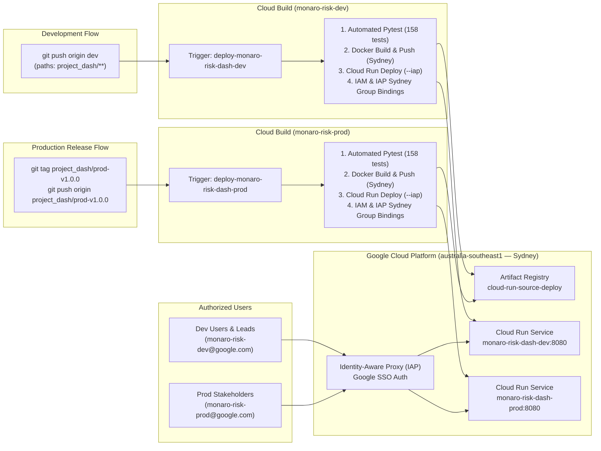
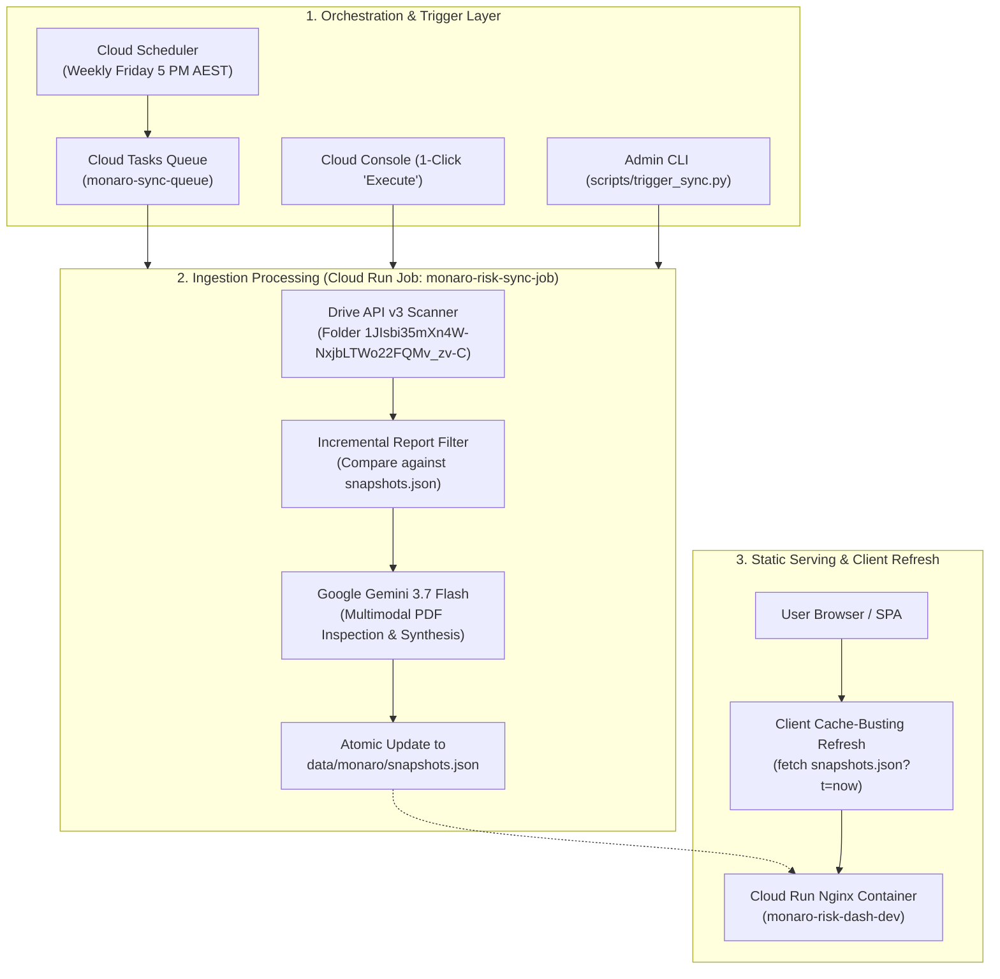

# 🚀 Project Monaro Risk Governance Platform — Unified Deployment & Operations Guide

This guide provides the complete, canonical documentation for deploying, provisioning, and operating the **Project Monaro Risk Governance Platform** across both **Development (`monaro-risk-dev`)** and **Production (`monaro-risk-prod`)** environments in Google Cloud's Australian region (**`australia-southeast1` — Sydney**).

Secured with **Identity-Aware Proxy (IAP)** for corporate Google SSO login and automated via **Google Cloud Build** and **GitHub Actions**.

---

> [!CAUTION]
> ### 🚨 CRITICAL OPS NOTICE: 90-Day Temporary Project Expiration
> Both `monaro-risk-prod` and `monaro-risk-dev` environments are currently provisioned as **90-day temporary Google Cloud sandbox projects**.
> * **Action Required**: A permanent Commonwealth / Project Monaro billing account MUST be attached to `monaro-risk-prod` in Pantheon Billing before the 90-day expiration window.
> * **Consequence of Inaction**: If a permanent billing account is not attached prior to day 90, Google Cloud will automatically suspend and delete all project resources, Cloud Run services, and Artifact Registry container images.

---

## 🏛️ Environment Invariants & System Matrix

| Parameter | Development (`dev`) | Production (`prod`) |
| :--- | :--- | :--- |
| **GCP Project ID** | `monaro-risk-dev` | **`monaro-risk-prod`** |
| **Deployment Region** | **`australia-southeast1`** (Sydney) | **`australia-southeast1`** (Sydney) |
| **Cloud Run Service Name** | `monaro-risk-dash-dev` | **`monaro-risk-dash-prod`** |
| **Active Git Branch** | `dev` | **`dev`** *(All code remains on `dev`)* |
| **Deployment Trigger Event** | Push to `dev` branch (`project_dash/**`) | **Push tag matching `^project_dash/prod-.*$`** |
| **Artifact Registry Repo** | `cloud-run-source-deploy` (Sydney) | `cloud-run-source-deploy` (Sydney) |
| **IAP Google SSO Group** | `monaro-risk-dev@google.com`<br>`monaro-risk-dev@twosync.google.com` | **`monaro-risk-prod@google.com`**<br>**`monaro-risk-prod@twosync.google.com`** |
| **Deployer Service Account** | `github-deployer@monaro-risk-dev.iam...` | **`github-deployer@monaro-risk-prod.iam...`** |
| **Data Sync & Ingestion** | Scheduled Ingestion Job (`monaro-risk-sync-job`) | Scheduled Ingestion Job (`monaro-risk-sync-job`) |
| **Client Refresh Method** | Static Cache-Busting Check (`checkForUpdates()`) | Static Cache-Busting Check (`checkForUpdates()`) |

---

## 🧭 Quick Navigation: Live Dashboards & Pantheon Consoles

| Resource / Console | Development (`monaro-risk-dev`) | Production (`monaro-risk-prod`) | Global & Corp Links |
| :--- | :--- | :--- | :--- |
| **Live Deployed Dashboard** | • [👉 Monaro Live (Dev)](https://monaro-risk-dash-dev-525025654699.australia-southeast1.run.app/?project=f-dse)<br>• [👉 Aurora Showcase (Dev)](https://monaro-risk-dash-dev-525025654699.australia-southeast1.run.app/?project=sample) | • [👉 Monaro Live (Prod)](https://monaro-risk-dash-prod-525025654699.australia-southeast1.run.app/?project=f-dse)<br>• [👉 Aurora Showcase (Prod)](https://monaro-risk-dash-prod-525025654699.australia-southeast1.run.app/?project=sample) | • [Local Monaro (Port 9000)](http://uk-bh-cloudtop.c.googlers.com:9000/?project=f-dse)<br>• [Local Aurora (Port 9000)](http://uk-bh-cloudtop.c.googlers.com:9000/?project=sample) |
| **Cloud Run Services (Web)** | [👉 Cloud Run Web (Dev)](https://pantheon.corp.google.com/run?project=monaro-risk-dev) | [👉 Cloud Run Web (Prod)](https://pantheon.corp.google.com/run?project=monaro-risk-prod) | — |
| **Cloud Run Jobs (Sync)** | [👉 Ingestion Job (Dev)](https://pantheon.corp.google.com/run/jobs?project=monaro-risk-dev) | [👉 Ingestion Job (Prod)](https://pantheon.corp.google.com/run/jobs?project=monaro-risk-prod) | — |
| **Cloud Tasks Queues** | [👉 Sync Queue (Dev)](https://pantheon.corp.google.com/cloudtasks?project=monaro-risk-dev) | [👉 Sync Queue (Prod)](https://pantheon.corp.google.com/cloudtasks?project=monaro-risk-prod) | — |
| **Cloud Scheduler** | [👉 Schedules (Dev)](https://pantheon.corp.google.com/cloudscheduler?project=monaro-risk-dev) | [👉 Schedules (Prod)](https://pantheon.corp.google.com/cloudscheduler?project=monaro-risk-prod) | — |
| **Cloud Build Triggers** | [👉 Build Triggers (Dev)](https://pantheon.corp.google.com/cloud-build/triggers?project=monaro-risk-dev) | [👉 Build Triggers (Prod)](https://pantheon.corp.google.com/cloud-build/triggers?project=monaro-risk-prod) | [Connected Repositories](https://pantheon.corp.google.com/cloud-build/repositories) |
| **Cloud Build History** | [👉 Build History (Dev)](https://pantheon.corp.google.com/cloud-build/builds?project=monaro-risk-dev) | [👉 Build History (Prod)](https://pantheon.corp.google.com/cloud-build/builds?project=monaro-risk-prod) | — |
| **Artifact Registry** | [👉 Docker Registry (Dev)](https://pantheon.corp.google.com/artifacts?project=monaro-risk-dev) | [👉 Docker Registry (Prod)](https://pantheon.corp.google.com/artifacts?project=monaro-risk-prod) | — |
| **Cloud Logging** | [👉 Logs Explorer (Dev)](https://pantheon.corp.google.com/logs/query?project=monaro-risk-dev) | [👉 Logs Explorer (Prod)](https://pantheon.corp.google.com/logs/query?project=monaro-risk-prod) | — |
| **Error Reporting & Alerts** | [👉 Error Reporting (Dev)](https://pantheon.corp.google.com/errors?project=monaro-risk-dev) | [👉 Error Reporting (Prod)](https://pantheon.corp.google.com/errors?project=monaro-risk-prod) | — |
| **Identity-Aware Proxy (IAP)** | [👉 IAP Access (Dev)](https://pantheon.corp.google.com/security/iap?project=monaro-risk-dev) | [👉 IAP Access (Prod)](https://pantheon.corp.google.com/security/iap?project=monaro-risk-prod) | [OAuth Consent Screen](https://pantheon.corp.google.com/apis/credentials/consent) |
| **IAM & Permissions** | [👉 IAM Permissions (Dev)](https://pantheon.corp.google.com/iam-admin/iam?project=monaro-risk-dev) | [👉 IAM Permissions (Prod)](https://pantheon.corp.google.com/iam-admin/iam?project=monaro-risk-prod) | — |
| **Service Accounts** | [👉 Service Accounts (Dev)](https://pantheon.corp.google.com/iam-admin/serviceaccounts?project=monaro-risk-dev) | [👉 Service Accounts (Prod)](https://pantheon.corp.google.com/iam-admin/serviceaccounts?project=monaro-risk-prod) | — |
| **Cloud Billing & Costs** | [👉 Billing Reports (Dev)](https://pantheon.corp.google.com/billing) | [👉 Billing Reports (Prod)](https://pantheon.corp.google.com/billing) | [👉 Cost & API Review Guide](./CLOUD_COSTS_AND_API_REVIEW.md) |
| **Google Groups (Access)** | [👉 monaro-risk-dev@google.com](https://groups.google.com/a/google.com/g/monaro-risk-dev) | [👉 monaro-risk-prod@google.com](https://groups.google.com/a/google.com/g/monaro-risk-prod) | [Google Groups Home](https://groups.google.com) |
| **Nexus Portal & Ownership** | [👉 Nexus (monaro-risk-dev)](http://go/nexus) (`%monaro-risk-dev.prod`) | [👉 Nexus (monaro-risk-prod)](http://go/nexus) (`%monaro-risk-prod.prod`) | [go/nexus](http://go/nexus) & [go/idp](http://go/idp) |
| **Ganpati Groups (MDB)** | `%monaro-risk-dev.prod` | `%monaro-risk-prod.prod` | `%monaro-risk-admin.prod` |

---

## 🏗️ Architecture & Security Model



---

## 🚀 Workflows: Developing & Deploying

### 1. Everyday Developer Workflow (`dev`)
All day-to-day development occurs on the **`dev`** branch:

```bash
# 1. Edit code, templates, or scripts under project_dash/
# 2. Run local unit tests to verify
pytest

# 3. Commit and push to dev branch
git add project_dash/
git commit -m "feat(dashboard): add new risk indicator widget"
git push origin dev
```
* **Trigger**: Cloud Build trigger `deploy-monaro-risk-dash-dev` automatically executes [`deploy/cloudbuild.yaml`](file:///usr/local/google/home/brendanhills/dev/uk-bh-experiments/project_dash/deploy/cloudbuild.yaml).
* **Target**: Deploys to `monaro-risk-dash-dev` in `australia-southeast1`.

### 2. Promoting a Release to Production (`prod`)
Production deployments do **not** use a separate code branch. All code remains on `dev` and promotions are gated via Git release tags:

```bash
# 1. Ensure you are on dev and all tests pass
git checkout dev
git pull origin dev
pytest

# 2. Create a versioned production tag
git tag project_dash/prod-v1.0.0

# 3. Push the tag to remote
git push origin project_dash/prod-v1.0.0
```
* **Trigger**: Cloud Build trigger `deploy-monaro-risk-dash-prod` detects the tag matching `^project_dash/prod-.*$`.
* **Target**: Builds and deploys container to `monaro-risk-dash-prod` in `australia-southeast1` with zero downtime.

---

## ⚡ Turnkey Environment Provisioning

### Method A: One-Command Scripted Provisioning (Recommended)

The repository provides [`deploy/provision_environment.sh`](file:///usr/local/google/home/brendanhills/dev/uk-bh-experiments/project_dash/deploy/provision_environment.sh) to idempotently provision either environment in Sydney with all 14 APIs, IAM permissions, triggers, and alerting policies:

```bash
# Provision Development Environment (monaro-risk-dev in Sydney)
./deploy/provision_environment.sh dev

# Provision Production Environment (monaro-risk-prod in Sydney)
./deploy/provision_environment.sh prod
```

#### What `provision_environment.sh` Automates:
1. **Enables 14 GCP APIs**: `clouderrorreporting`, `logging`, `monitoring`, `cloudbuild`, `run`, `artifactregistry`, `iap`, `compute`, `aiplatform`, `containeranalysis`, `containerscanning`, `sheets`, `drive`, `iam`.
2. **Creates Service Account**: `github-deployer@<PROJECT_ID>.iam.gserviceaccount.com`.
3. **Binds Least-Privilege IAM Roles**:
   * `roles/run.admin`
   * `roles/artifactregistry.admin`
   * `roles/iam.serviceAccountUser`
   * `roles/iap.admin`
   * `roles/logging.logWriter`
   * `roles/storage.objectViewer`
   * `roles/containeranalysis.occurrences.editor`
4. **Artifact Registry**: Creates repository `cloud-run-source-deploy` in `australia-southeast1`.
5. **Cloud Build Triggers**: Connects GitHub repository `cloud-gtm/uk-bh-experiments` and creates branch trigger (`^dev$`) or tag trigger (`^project_dash/prod-.*$`).
6. **Error Reporting & Monitoring Alerts**: Creates email notification channel for `<PROJECT_ID>-admin@google.com` and creates a log-based alert policy for container crashes and 5xx exceptions.
7. **Cloud Run Invoker & IAP Web Access**: Grants `roles/run.invoker` and `roles/iap.httpsResourceAccessor` in Sydney to:
   * `group:<PROJECT_ID>@google.com`
   * `group:<PROJECT_ID>@twosync.google.com`
   * `user:brendanhills@google.com`
   * `user:allins@google.com`
   * `serviceAccount:service-<PROJECT_NUM>@gcp-sa-iap.iam.gserviceaccount.com` (Invoker only)

---

### Method B: Google Cloud Console ("Click-Ops") Walkthrough

If configuring manually via Pantheon:

#### Step 0: Create Project & Link Billing
1. Open **[Pantheon > New Project](https://pantheon.corp.google.com/projectcreate)**.
2. Set **Project ID**: `monaro-risk-prod` (or `monaro-risk-dev`).
3. Link a permanent billing account.

#### Step 1: Enable APIs
1. Open **[APIs & Services > Library](https://pantheon.corp.google.com/apis/library)**.
2. Enable the 14 APIs listed above.

#### Step 2: Create Artifact Registry in Sydney
1. Open **[Artifact Registry > Repositories](https://pantheon.corp.google.com/artifacts)**.
2. Click **"+ CREATE REPOSITORY"**.
3. Name: `cloud-run-source-deploy` | Format: `Docker` | Region: **`australia-southeast1 (Sydney)`**.

#### Step 3: Connect GitHub Repository
1. Open **[Cloud Build > Repositories (1st gen)](https://pantheon.corp.google.com/cloud-build/repositories/1st-gen)**.
2. Click **"CONNECT REPOSITORY"** $\rightarrow$ select **GitHub (Cloud Build GitHub App)** $\rightarrow$ authorize `cloud-gtm` $\rightarrow$ select `uk-bh-experiments`.

#### Step 4: Configure OAuth Consent Screen & IAP
1. Open **[APIs & Services > OAuth Consent Screen](https://pantheon.corp.google.com/apis/credentials/consent)**.
2. User Type: **Internal** (Corp Google) $\rightarrow$ App name: `Project Monaro Risk Dashboard`.
3. Support email: your email or admin group.
4. Save and finish.

---

## 📦 Automated Pipeline Reference (`deploy/cloudbuild.yaml`)

The CI/CD pipeline definition lives in [`deploy/cloudbuild.yaml`](file:///usr/local/google/home/brendanhills/dev/uk-bh-experiments/project_dash/deploy/cloudbuild.yaml). It executes 5 streamlined, high-efficiency stages:

1. **Automated Pytest (`~22s`)**: Executes the full test suite (159 unit and regression tests) in `python:3.13-slim`.
2. **Dynamic Build Metadata Injection (`<1s`)**: Reuses the cached `python:3.13-slim` container from Step 1 to inject dynamic commit SHA, branch/tag, region, and UTC timestamp into `data/build_info.json`. Reusing the cached runner avoids downloading multi-GB SDK images.
3. **Container Build (`~7s`)**: Builds the production container using multi-stage [`deploy/Dockerfile`](file:///usr/local/google/home/brendanhills/dev/uk-bh-experiments/project_dash/deploy/Dockerfile), tagged with both `$COMMIT_SHA` and `latest`.
4. **Concurrent Image Push (`~3s`)**: Pushes container tags to Artifact Registry in Sydney using `docker push --all-tags`.
5. **Cloud Run Deployment (`~16s`)**: Deploys the revision to Cloud Run using Google's dedicated and pre-warmed `gcr.io/cloud-builders/gcloud` builder with `--iap`, `--no-allow-unauthenticated`, and build provenance annotations.

### ⚙️ Worker Pool Architecture: Why the Default Pool is Optimal

The pipeline deliberately omits custom `machineType` overrides in `options:` to execute on the **Cloud Build Default Standard Worker Pool** (`UNSPECIFIED` / 1–2 vCPUs, 4–8 GB RAM):

- **Instant Worker Allocation (~2s Queue Latency)**: Google Cloud Build maintains a massive, pre-warmed default worker pool in `australia-southeast1`. Builds transition from `QUEUED` to `WORKING` almost instantaneously (~2 seconds), whereas custom high-CPU machines (`E2_HIGHCPU_8`, etc.) incur ~60 seconds of cold-start VM provisioning delays.
- **Empirical Performance Equivalence**: In live benchmarking, total step execution on the default pool was **52.2 seconds** vs **52.98 seconds** on `E2_HIGHCPU_8`. Because this repository builds lightweight static assets and Nginx containers, CPU is not the bottleneck; end-to-end wall-clock turnaround is **46% faster** on the default pool due to zero queue waiting.
- **Cost Efficiency & Free Tier**: Default standard workers are eligible for Google Cloud's **120 free build-minutes per day** (and only $0.003/min thereafter), avoiding unnecessary multi-core infrastructure spend.

> [!NOTE]
> **Static Infrastructure Separation**:
> Infrastructure provisioning (creating Artifact Registry repositories, service account permissions, and Cloud Run / IAP access policies) is strictly decoupled from the per-commit build pipeline and is codified in [`deploy/provision_environment.sh`](file:///usr/local/google/home/brendanhills/dev/uk-bh-experiments/project_dash/deploy/provision_environment.sh). These idempotent checks are omitted from `cloudbuild.yaml` to ensure sub-minute deployment speeds.

> [!IMPORTANT]
> **Mandatory IAP Access Policy Requirement (`roles/iap.httpsResourceAccessor`)**:
> Whenever Identity-Aware Proxy (`--iap`) is enabled on Cloud Run, granting `roles/run.invoker` alone causes `403 Forbidden` errors at the Google IAP proxy layer. You **must** also grant `roles/iap.httpsResourceAccessor` on the Cloud Run IAP resource via `gcloud beta iap web add-iam-policy-binding` in the deployment region (`australia-southeast1`) for all user and group accounts (`@google.com` and `@twosync.google.com`). This is managed during environment setup via [`deploy/provision_environment.sh`](file:///usr/local/google/home/brendanhills/dev/uk-bh-experiments/project_dash/deploy/provision_environment.sh).

---

## 🛡️ Day-2 Operations & SRE Runbooks

### Runbook 1: Instant Rollback to a Previous Revision (Zero-Downtime)
If a newly deployed revision introduces issues, rollback instantly by shifting 100% of traffic back to the previous healthy revision:

#### Console:
1. Open **[Cloud Run > Service Details > Revisions](https://pantheon.corp.google.com/run)**.
2. Click **"MANAGE TRAFFIC"**.
3. Set the previous healthy revision to **100%** traffic. Click **"SAVE"**.

#### CLI:
```bash
# List revisions
gcloud run revisions list \
  --service=monaro-risk-dash-prod \
  --region=australia-southeast1 \
  --project=monaro-risk-prod

# Shift 100% traffic to previous revision
gcloud run services update-traffic monaro-risk-dash-prod \
  --to-revisions=monaro-risk-dash-prod-00042-xyz=100 \
  --region=australia-southeast1 \
  --project=monaro-risk-prod
```

---

### Runbook 2: Emergency Container Image Rollback
To redeploy a specific historical container image from Artifact Registry:

```bash
gcloud run deploy monaro-risk-dash-prod \
  --image=australia-southeast1-docker.pkg.dev/monaro-risk-prod/cloud-run-source-deploy/monaro-risk-dash-prod:<HISTORICAL_COMMIT_SHA> \
  --region=australia-southeast1 \
  --project=monaro-risk-prod
```

---

### Runbook 3: Managing User & Group Access
Access is governed primarily through Google Groups (`monaro-risk-dev@google.com` and `monaro-risk-prod@google.com`).

* **Preferred (No GCP Changes Required)**:
  Add or remove members directly in [Google Groups](https://groups.google.com/a/google.com/g/monaro-risk-prod). Group membership propagates automatically within minutes.
* **Direct Emergency Access via CLI**:
  ```bash
  # 1. Cloud Run Invoker
  gcloud run services add-iam-policy-binding monaro-risk-dash-prod \
    --project=monaro-risk-prod \
    --region=australia-southeast1 \
    --member="user:newoperator@google.com" \
    --role="roles/run.invoker"

  # 2. IAP Web Access
  gcloud beta iap web add-iam-policy-binding \
    --project=monaro-risk-prod \
    --resource-type="cloud-run" \
    --service="monaro-risk-dash-prod" \
    --region=australia-southeast1 \
    --member="user:newoperator@google.com" \
    --role="roles/iap.httpsResourceAccessor"
  ```

---

### Runbook 4: Monitoring, Error Reporting & Crash Alert Diagnostics
1. **Cloud Error Reporting**:
   Open **[Error Reporting](https://pantheon.corp.google.com/errors?project=monaro-risk-prod)** to inspect grouped exception stack traces.
2. **Live Container Logs**:
   ```bash
   gcloud logging read "resource.type=cloud_run_revision AND resource.labels.service_name=monaro-risk-dash-prod" \
     --project=monaro-risk-prod \
     --limit=50 \
     --format="table(timestamp,severity,textPayload)"
   ```

---

### Runbook 5: 90-Day Sandbox Billing Migration Checklist
Before day 90 of sandbox project creation:
1. Confirm the permanent billing account ID in [Google Cloud Billing Console](https://pantheon.corp.google.com/billing).
2. Attach permanent billing:
   ```bash
   gcloud beta billing projects link monaro-risk-prod \
     --billing-account=<PERMANENT_BILLING_ACCOUNT_ID>
   ```
3. Verify in Pantheon: **Billing > Account Management** $\rightarrow$ verify status is **Active** with no expiration notice.

---

### Runbook 6: Troubleshooting Common Issues

| Symptom | Probable Root Cause | Resolution |
| :--- | :--- | :--- |
| **`403 Forbidden` ("You do not have access")** | Missing `roles/iap.httpsResourceAccessor` on Cloud Run IAP resource. | Grant role via `gcloud beta iap web add-iam-policy-binding --resource-type=cloud-run ...` in `australia-southeast1`. |
| **`403 Forbidden` ("Access denied by policy")** | User is not in `monaro-risk-dev` or `monaro-risk-prod` group. | Add user to Google Group at `groups.google.com`. |
| **`502 / 503 Bad Gateway`** | Container failed to start or did not bind port `8080`. | Check Cloud Logging: `resource.type=cloud_run_revision AND severity>=ERROR`. Ensure `PORT=8080` is listened to. |
| **Cloud Build Trigger Permission Error** | `github-deployer` service account missing `roles/run.admin` or `roles/iam.serviceAccountUser`. | Re-run Step 3 in `./deploy/provision_environment.sh`. |
| **Docker Build Failure in CI** | Python dependency conflict or broken test assertion. | Run `pip install -r requirements.txt && pytest` locally to replicate. |

---

### Runbook 7: Data Synchronization, Scheduled Task Management & Client Refresh

The Project Dash platform operates a fully decoupled data architecture where data ingestion, AI processing, and presentation are independently managed:
- **Presentation**: Pure static web application served via Nginx on Cloud Run (`monaro-risk-dash-dev` / `monaro-risk-dash-prod`).
- **Ingestion Worker**: Containerized batch processor (`deploy/Dockerfile.sync`) executing as a Cloud Run Job (`monaro-risk-sync-job`).
- **Orchestration**: Cloud Scheduler triggers the ingestion job on a recurring weekly schedule, with Cloud Tasks managing execution throttling and retries.



---

#### 7.1 How Data is Synced (Ingestion Lifecycle)
The standalone ingestion script ([`scripts/sync_drive.py`](../scripts/sync_drive.py)) and pipeline ([`scripts/pipeline.py`](../scripts/pipeline.py)) execute the following steps:

1. **Google Drive Live Discovery**:
   - Queries Google Drive API v3 for all status reports in folder `1JIsbi35mXn4W-NxjbLTWo22FQMv_zv-C` using Application Default Credentials (ADC) or the deployer service account (`github-deployer@...`).
   - Identifies weekly reporting packs (PDF/Docs), extracting week identifiers (e.g. `Week 29`, `Week 30`) and publication dates.

2. **Incremental Ingestion Filtering**:
   - Inspects the existing [`data/monaro/snapshots.json`](../data/monaro/snapshots.json) dataset.
   - Any report whose week number already exists in `snapshots.json` is safely skipped, avoiding redundant API calls and model latency.

3. **Multimodal AI Analysis with Gemini 3.7 Flash**:
   - Unprocessed PDF reports are sent to **`gemini-3.7-flash`** via Google GenAI SDK.
   - Extracts structured executive briefings (Executive, Technical, Governance perspectives), Top 3 critical action items, and sleeper outlier warnings.
   - Computes inherent and residual risk delta distributions across the 5×5 matrix.

4. **Atomic Snapshot Update**:
   - New weekly snapshots are appended to `snapshots.json` and saved atomically.
   - In production, updated data files are synchronized to Cloud Storage or deployed directly into the web container.

---

#### 7.2 How Data is Refreshed in the Client UI
Users viewing the live dashboard do not need to refresh their browser or trigger backend server operations:

1. **Read-Only Data Provenance Hub**:
   - Clicking **"Workspace Sync"** in the top navigation bar opens the **Data Provenance Hub** modal (`#sheetsModal`).
   - Displays direct links to all authoritative Google Workspace streams:
     - **Stream 1**: Joint Program Risk & Issue Register (Google Sheet)
     - **Stream 2**: Team Google Delivery Register (Google Sheet)
     - **Stream 3**: Weekly Status Reports Archive (Google Drive Folder)
     - **Stream 4**: Project Knowledge Base & Contract Blueprints (NotebookLM)
   - Displays the **Verified Ingested Report** badge indicating the active reporting week.

2. **Client-Side Cache-Busting Freshness Check**:
   - In the modal, clicking **"↻ Check for Updates"** invokes the client-side `checkForUpdates()` function.
   - Issues a non-cached fetch:
     ```javascript
     fetch(`data/${CURRENT_PROJECT}/snapshots.json?t=${Date.now()}`, { cache: 'no-store' })
     ```
   - If a new week has been published by the ingestion worker, the in-memory state (`TIME_MACHINE_SNAPSHOTS`) updates dynamically and re-renders the 5×5 heatmap, KPI pills, and trends charts without tearing down current UI interactions.

---

#### 7.3 Managing the Scheduled Task (Cloud Scheduler & Cloud Tasks)

##### Viewing and Modifying Ingestion Frequency
The ingestion job is governed by **Cloud Scheduler** in `australia-southeast1`:

```bash
# List scheduled jobs
gcloud scheduler jobs list \
  --location=australia-southeast1 \
  --project=monaro-risk-dev

# View schedule details
gcloud scheduler jobs describe monaro-sync-schedule \
  --location=australia-southeast1 \
  --project=monaro-risk-dev

# Update schedule frequency (e.g. run every Friday at 5:00 PM Sydney time)
gcloud scheduler jobs update http monaro-sync-schedule \
  --location=australia-southeast1 \
  --project=monaro-risk-dev \
  --schedule="0 17 * * 5" \
  --time-zone="Australia/Sydney"
```

##### Pausing and Resuming the Scheduled Task
To pause automatic ingestion during maintenance or change freezes:

```bash
# Pause scheduled ingestion
gcloud scheduler jobs pause monaro-sync-schedule \
  --location=australia-southeast1 \
  --project=monaro-risk-dev

# Resume scheduled ingestion
gcloud scheduler jobs resume monaro-sync-schedule \
  --location=australia-southeast1 \
  --project=monaro-risk-dev
```

##### Managing Cloud Run Job Executions & Logs
The background processing container runs as a Cloud Run Job:

```bash
# View Job configuration
gcloud run jobs describe monaro-risk-sync-job \
  --region=australia-southeast1 \
  --project=monaro-risk-dev

# List historical job executions
gcloud run jobs executions list \
  --job=monaro-risk-sync-job \
  --region=australia-southeast1 \
  --project=monaro-risk-dev

# Stream logs for the latest job execution
gcloud logging read "resource.type=cloud_run_job AND resource.labels.job_name=monaro-risk-sync-job" \
  --project=monaro-risk-dev \
  --limit=50 \
  --format="table(timestamp,severity,textPayload)"
```

##### Managing the Cloud Tasks Queue
The `monaro-sync-queue` regulates concurrency and retries for ingestion tasks:

```bash
# Inspect queue status and depth
gcloud tasks queues describe monaro-sync-queue \
  --location=australia-southeast1 \
  --project=monaro-risk-dev

# Adjust max concurrent dispatches (prevent duplicate simultaneous Gemini calls)
gcloud tasks queues update monaro-sync-queue \
  --location=australia-southeast1 \
  --project=monaro-risk-dev \
  --max-concurrent-dispatches=1 \
  --max-attempts=3 \
  --min-backoff=15s
```

---

#### 7.4 On-Demand Ingestion Triggers (Dev & Admin)

When new files are added to Google Drive out-of-cycle, developers and administrators can trigger synchronization immediately through three methods:

##### 1. Google Cloud Console (1-Click Web UI)
- **Cloud Run Jobs**: Navigate to **[Cloud Run Jobs in Pantheon](https://pantheon.corp.google.com/run/jobs?project=monaro-risk-dev)** $\rightarrow$ select `monaro-risk-sync-job` $\rightarrow$ click **Execute**.
- **Cloud Scheduler**: Navigate to **[Cloud Scheduler in Pantheon](https://pantheon.corp.google.com/cloudscheduler?project=monaro-risk-dev)** $\rightarrow$ find `monaro-sync-schedule` $\rightarrow$ click **Force Run**.

##### 2. Developer / Admin CLI Tool (`scripts/trigger_sync.py`)
```bash
# Trigger remote Cloud Run Job in Google Cloud:
python3 scripts/trigger_sync.py --mode=cloud --project=monaro-risk-dev --region=australia-southeast1

# Or trigger directly using gcloud:
gcloud run jobs execute monaro-risk-sync-job \
  --project=monaro-risk-dev \
  --region=australia-southeast1 \
  --wait

# Run local standalone ingestion test:
python3 scripts/trigger_sync.py --mode=local
```

##### 3. Cloud Tasks HTTP Enqueue
```bash
gcloud tasks create-http-task \
  --queue=monaro-sync-queue \
  --location=australia-southeast1 \
  --project=monaro-risk-dev \
  --url="https://australia-southeast1-run.googleapis.com/apis/run.googleapis.com/v1/namespaces/monaro-risk-dev/jobs/monaro-risk-sync-job:run" \
  --oauth-service-account-email="github-deployer@monaro-risk-dev.iam.gserviceaccount.com" \
  --header="Content-Type:application/json"
```


