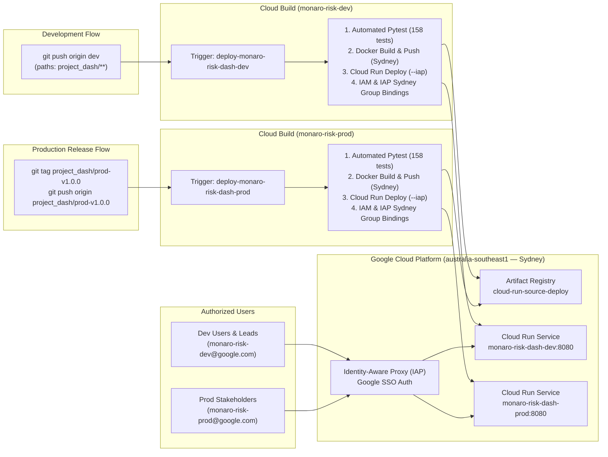

# 🚀 Project Monaro Risk Governance Platform — Unified Deployment & Operations Guide

This guide provides the complete, canonical documentation for deploying, provisioning, and operating the **Project Monaro Risk Governance Platform** across both **Development (`monaro-risk-dev`)** and **Production (`monaro-risk-prod`)** environments in Google Cloud's Australian region (**`australia-southeast1` — Sydney**).

Secured with **Identity-Aware Proxy (IAP)** for corporate Google SSO login and automated via **Google Cloud Build** and **GitHub Actions**.

---

> [!CAUTION]
> ### 🚨 CRITICAL OPS NOTICE: 90-Day Temporary Project Expiration
> Both `monaro-risk-prod` and `monaro-risk-dev` environments are currently provisioned as **90-day temporary Google Cloud sandbox projects**.
> * **Action Required**: A permanent Commonwealth / Project Monaro billing account MUST be attached to `monaro-risk-prod` in Pantheon Billing before the 90-day expiration window.
> * **Consequence of Inaction**: If a permanent billing account is not attached prior to day 90, Google Cloud will automatically suspend and delete all project resources, Cloud Run services, and Artifact Registry container images.

---

## 🏛️ Environment Invariants & System Matrix

| Parameter | Development (`dev`) | Production (`prod`) |
| :--- | :--- | :--- |
| **GCP Project ID** | `monaro-risk-dev` | **`monaro-risk-prod`** |
| **Deployment Region** | **`australia-southeast1`** (Sydney) | **`australia-southeast1`** (Sydney) |
| **Cloud Run Service Name** | `monaro-risk-dash-dev` | **`monaro-risk-dash-prod`** |
| **Active Git Branch** | `dev` | **`dev`** *(All code remains on `dev`)* |
| **Deployment Trigger Event** | Push to `dev` branch (`project_dash/**`) | **Push tag matching `^project_dash/prod-.*$`** |
| **Artifact Registry Repo** | `cloud-run-source-deploy` (Sydney) | `cloud-run-source-deploy` (Sydney) |
| **IAP Google SSO Group** | `monaro-risk-dev@google.com`<br>`monaro-risk-dev@twosync.google.com` | **`monaro-risk-prod@google.com`**<br>**`monaro-risk-prod@twosync.google.com`** |
| **Deployer Service Account** | `github-deployer@monaro-risk-dev.iam...` | **`github-deployer@monaro-risk-prod.iam...`** |
| **Live Data Sync Method** | In-Dashboard **"Sync Workspace"** | In-Dashboard **"Sync Workspace"** |

---

## 🧭 Quick Navigation: Live Dashboards & Pantheon Consoles

| Resource / Console | Development (`monaro-risk-dev`) | Production (`monaro-risk-prod`) | Global & Corp Links |
| :--- | :--- | :--- | :--- |
| **Live Deployed Dashboard** | • [👉 Monaro Live (Dev)](https://monaro-risk-dash-dev-525025654699.australia-southeast1.run.app/?project=f-dse)<br>• [👉 Aurora Showcase (Dev)](https://monaro-risk-dash-dev-525025654699.australia-southeast1.run.app/?project=sample) | • [👉 Monaro Live (Prod)](https://monaro-risk-dash-prod-525025654699.australia-southeast1.run.app/?project=f-dse)<br>• [👉 Aurora Showcase (Prod)](https://monaro-risk-dash-prod-525025654699.australia-southeast1.run.app/?project=sample) | • [Local Monaro (Port 9000)](http://uk-bh-cloudtop.c.googlers.com:9000/?project=f-dse)<br>• [Local Aurora (Port 9000)](http://uk-bh-cloudtop.c.googlers.com:9000/?project=sample) |
| **Cloud Run Services** | [👉 Cloud Run (Dev)](https://pantheon.corp.google.com/run?project=monaro-risk-dev) | [👉 Cloud Run (Prod)](https://pantheon.corp.google.com/run?project=monaro-risk-prod) | — |
| **Cloud Build Triggers** | [👉 Build Triggers (Dev)](https://pantheon.corp.google.com/cloud-build/triggers?project=monaro-risk-dev) | [👉 Build Triggers (Prod)](https://pantheon.corp.google.com/cloud-build/triggers?project=monaro-risk-prod) | [Connected Repositories](https://pantheon.corp.google.com/cloud-build/repositories) |
| **Cloud Build History** | [👉 Build History (Dev)](https://pantheon.corp.google.com/cloud-build/builds?project=monaro-risk-dev) | [👉 Build History (Prod)](https://pantheon.corp.google.com/cloud-build/builds?project=monaro-risk-prod) | — |
| **Artifact Registry** | [👉 Docker Registry (Dev)](https://pantheon.corp.google.com/artifacts?project=monaro-risk-dev) | [👉 Docker Registry (Prod)](https://pantheon.corp.google.com/artifacts?project=monaro-risk-prod) | — |
| **Cloud Logging** | [👉 Logs Explorer (Dev)](https://pantheon.corp.google.com/logs/query?project=monaro-risk-dev) | [👉 Logs Explorer (Prod)](https://pantheon.corp.google.com/logs/query?project=monaro-risk-prod) | — |
| **Error Reporting & Alerts** | [👉 Error Reporting (Dev)](https://pantheon.corp.google.com/errors?project=monaro-risk-dev) | [👉 Error Reporting (Prod)](https://pantheon.corp.google.com/errors?project=monaro-risk-prod) | — |
| **Identity-Aware Proxy (IAP)** | [👉 IAP Access (Dev)](https://pantheon.corp.google.com/security/iap?project=monaro-risk-dev) | [👉 IAP Access (Prod)](https://pantheon.corp.google.com/security/iap?project=monaro-risk-prod) | [OAuth Consent Screen](https://pantheon.corp.google.com/apis/credentials/consent) |
| **IAM & Permissions** | [👉 IAM Permissions (Dev)](https://pantheon.corp.google.com/iam-admin/iam?project=monaro-risk-dev) | [👉 IAM Permissions (Prod)](https://pantheon.corp.google.com/iam-admin/iam?project=monaro-risk-prod) | — |
| **Service Accounts** | [👉 Service Accounts (Dev)](https://pantheon.corp.google.com/iam-admin/serviceaccounts?project=monaro-risk-dev) | [👉 Service Accounts (Prod)](https://pantheon.corp.google.com/iam-admin/serviceaccounts?project=monaro-risk-prod) | — |
| **Google Groups (Access)** | [👉 monaro-risk-dev@google.com](https://groups.google.com/a/google.com/g/monaro-risk-dev) | [👉 monaro-risk-prod@google.com](https://groups.google.com/a/google.com/g/monaro-risk-prod) | [Google Groups Home](https://groups.google.com) |
| **Nexus Portal & Ownership** | [👉 Nexus (monaro-risk-dev)](http://go/nexus) (`%monaro-risk-dev.prod`) | [👉 Nexus (monaro-risk-prod)](http://go/nexus) (`%monaro-risk-prod.prod`) | [go/nexus](http://go/nexus) & [go/idp](http://go/idp) |
| **Ganpati Groups (MDB)** | `%monaro-risk-dev.prod` | `%monaro-risk-prod.prod` | `%monaro-risk-admin.prod` |

---

## 🏗️ Architecture & Security Model



---

## 🚀 Workflows: Developing & Deploying

### 1. Everyday Developer Workflow (`dev`)
All day-to-day development occurs on the **`dev`** branch:

```bash
# 1. Edit code, templates, or scripts under project_dash/
# 2. Run local unit tests to verify
pytest

# 3. Commit and push to dev branch
git add project_dash/
git commit -m "feat(dashboard): add new risk indicator widget"
git push origin dev
```
* **Trigger**: Cloud Build trigger `deploy-monaro-risk-dash-dev` automatically executes [`deploy/cloudbuild.yaml`](file:///usr/local/google/home/brendanhills/dev/uk-bh-experiments/project_dash/deploy/cloudbuild.yaml).
* **Target**: Deploys to `monaro-risk-dash-dev` in `australia-southeast1`.

### 2. Promoting a Release to Production (`prod`)
Production deployments do **not** use a separate code branch. All code remains on `dev` and promotions are gated via Git release tags:

```bash
# 1. Ensure you are on dev and all tests pass
git checkout dev
git pull origin dev
pytest

# 2. Create a versioned production tag
git tag project_dash/prod-v1.0.0

# 3. Push the tag to remote
git push origin project_dash/prod-v1.0.0
```
* **Trigger**: Cloud Build trigger `deploy-monaro-risk-dash-prod` detects the tag matching `^project_dash/prod-.*$`.
* **Target**: Builds and deploys container to `monaro-risk-dash-prod` in `australia-southeast1` with zero downtime.

---

## ⚡ Turnkey Environment Provisioning

### Method A: One-Command Scripted Provisioning (Recommended)

The repository provides [`deploy/provision_environment.sh`](file:///usr/local/google/home/brendanhills/dev/uk-bh-experiments/project_dash/deploy/provision_environment.sh) to idempotently provision either environment in Sydney with all 14 APIs, IAM permissions, triggers, and alerting policies:

```bash
# Provision Development Environment (monaro-risk-dev in Sydney)
./deploy/provision_environment.sh dev

# Provision Production Environment (monaro-risk-prod in Sydney)
./deploy/provision_environment.sh prod
```

#### What `provision_environment.sh` Automates:
1. **Enables 14 GCP APIs**: `clouderrorreporting`, `logging`, `monitoring`, `cloudbuild`, `run`, `artifactregistry`, `iap`, `compute`, `aiplatform`, `containeranalysis`, `containerscanning`, `sheets`, `drive`, `iam`.
2. **Creates Service Account**: `github-deployer@<PROJECT_ID>.iam.gserviceaccount.com`.
3. **Binds Least-Privilege IAM Roles**:
   * `roles/run.admin`
   * `roles/artifactregistry.admin`
   * `roles/iam.serviceAccountUser`
   * `roles/iap.admin`
   * `roles/logging.logWriter`
   * `roles/storage.objectViewer`
   * `roles/containeranalysis.occurrences.editor`
4. **Artifact Registry**: Creates repository `cloud-run-source-deploy` in `australia-southeast1`.
5. **Cloud Build Triggers**: Connects GitHub repository `cloud-gtm/uk-bh-experiments` and creates branch trigger (`^dev$`) or tag trigger (`^project_dash/prod-.*$`).
6. **Error Reporting & Monitoring Alerts**: Creates email notification channel for `<PROJECT_ID>-admin@google.com` and creates a log-based alert policy for container crashes and 5xx exceptions.
7. **Cloud Run Invoker & IAP Web Access**: Grants `roles/run.invoker` and `roles/iap.httpsResourceAccessor` in Sydney to:
   * `group:<PROJECT_ID>@google.com`
   * `group:<PROJECT_ID>@twosync.google.com`
   * `user:brendanhills@google.com`
   * `user:allins@google.com`
   * `serviceAccount:service-<PROJECT_NUM>@gcp-sa-iap.iam.gserviceaccount.com` (Invoker only)

---

### Method B: Google Cloud Console ("Click-Ops") Walkthrough

If configuring manually via Pantheon:

#### Step 0: Create Project & Link Billing
1. Open **[Pantheon > New Project](https://pantheon.corp.google.com/projectcreate)**.
2. Set **Project ID**: `monaro-risk-prod` (or `monaro-risk-dev`).
3. Link a permanent billing account.

#### Step 1: Enable APIs
1. Open **[APIs & Services > Library](https://pantheon.corp.google.com/apis/library)**.
2. Enable the 14 APIs listed above.

#### Step 2: Create Artifact Registry in Sydney
1. Open **[Artifact Registry > Repositories](https://pantheon.corp.google.com/artifacts)**.
2. Click **"+ CREATE REPOSITORY"**.
3. Name: `cloud-run-source-deploy` | Format: `Docker` | Region: **`australia-southeast1 (Sydney)`**.

#### Step 3: Connect GitHub Repository
1. Open **[Cloud Build > Repositories (1st gen)](https://pantheon.corp.google.com/cloud-build/repositories/1st-gen)**.
2. Click **"CONNECT REPOSITORY"** $\rightarrow$ select **GitHub (Cloud Build GitHub App)** $\rightarrow$ authorize `cloud-gtm` $\rightarrow$ select `uk-bh-experiments`.

#### Step 4: Configure OAuth Consent Screen & IAP
1. Open **[APIs & Services > OAuth Consent Screen](https://pantheon.corp.google.com/apis/credentials/consent)**.
2. User Type: **Internal** (Corp Google) $\rightarrow$ App name: `Project Monaro Risk Dashboard`.
3. Support email: your email or admin group.
4. Save and finish.

---

## 📦 Automated Pipeline Reference (`deploy/cloudbuild.yaml`)

The CI/CD pipeline definition lives in [`deploy/cloudbuild.yaml`](file:///usr/local/google/home/brendanhills/dev/uk-bh-experiments/project_dash/deploy/cloudbuild.yaml). It executes 7 automated stages:

1. **Automated Pytest**: Executes the complete test suite (158 tests) in `python:3.13-slim`.
2. **Artifact Registry Check**: Ensures `cloud-run-source-deploy` repository exists in `${_REGION}` (`australia-southeast1`).
3. **Docker Build**: Builds production container using multi-stage [`deploy/Dockerfile`](file:///usr/local/google/home/brendanhills/dev/uk-bh-experiments/project_dash/deploy/Dockerfile) tagged with `$COMMIT_SHA` and `latest`.
4. **Docker Push**: Pushes image to Artifact Registry in Sydney.
5. **Cloud Run Deploy**: Deploys to Cloud Run with `--no-allow-unauthenticated` and `--iap` enabled in `${_REGION}`.
6. **IAP Service Agent Permission**: Grants `roles/run.invoker` to `service-<PROJECT_NUMBER>@gcp-sa-iap...`.
7. **IAM & IAP Group Access**:
   * Dynamically computes `TWOSYNC_GROUP=$(echo "${_ACCESS_GROUP}" | sed 's/@google.com/@twosync.google.com/')`.
   * Grants `roles/run.invoker` to both `@google.com` and `@twosync.google.com` groups, plus designated leads.
   * Grants `roles/iap.httpsResourceAccessor` on the Cloud Run IAP resource via `gcloud beta iap web add-iam-policy-binding`.

> [!IMPORTANT]
> **Mandatory IAP Access Policy Requirement (`roles/iap.httpsResourceAccessor`)**:
> Whenever Identity-Aware Proxy (`--iap`) is enabled on Cloud Run, granting `roles/run.invoker` alone causes `403 Forbidden` errors at the Google IAP proxy layer. You **must** also grant `roles/iap.httpsResourceAccessor` on the Cloud Run IAP resource via `gcloud beta iap web add-iam-policy-binding` in the deployment region (`australia-southeast1`) for all user and group accounts (`@google.com` and `@twosync.google.com`).

---

## 🛡️ Day-2 Operations & SRE Runbooks

### Runbook 1: Instant Rollback to a Previous Revision (Zero-Downtime)
If a newly deployed revision introduces issues, rollback instantly by shifting 100% of traffic back to the previous healthy revision:

#### Console:
1. Open **[Cloud Run > Service Details > Revisions](https://pantheon.corp.google.com/run)**.
2. Click **"MANAGE TRAFFIC"**.
3. Set the previous healthy revision to **100%** traffic. Click **"SAVE"**.

#### CLI:
```bash
# List revisions
gcloud run revisions list \
  --service=monaro-risk-dash-prod \
  --region=australia-southeast1 \
  --project=monaro-risk-prod

# Shift 100% traffic to previous revision
gcloud run services update-traffic monaro-risk-dash-prod \
  --to-revisions=monaro-risk-dash-prod-00042-xyz=100 \
  --region=australia-southeast1 \
  --project=monaro-risk-prod
```

---

### Runbook 2: Emergency Container Image Rollback
To redeploy a specific historical container image from Artifact Registry:

```bash
gcloud run deploy monaro-risk-dash-prod \
  --image=australia-southeast1-docker.pkg.dev/monaro-risk-prod/cloud-run-source-deploy/monaro-risk-dash-prod:<HISTORICAL_COMMIT_SHA> \
  --region=australia-southeast1 \
  --project=monaro-risk-prod
```

---

### Runbook 3: Managing User & Group Access
Access is governed primarily through Google Groups (`monaro-risk-dev@google.com` and `monaro-risk-prod@google.com`).

* **Preferred (No GCP Changes Required)**:
  Add or remove members directly in [Google Groups](https://groups.google.com/a/google.com/g/monaro-risk-prod). Group membership propagates automatically within minutes.
* **Direct Emergency Access via CLI**:
  ```bash
  # 1. Cloud Run Invoker
  gcloud run services add-iam-policy-binding monaro-risk-dash-prod \
    --project=monaro-risk-prod \
    --region=australia-southeast1 \
    --member="user:newoperator@google.com" \
    --role="roles/run.invoker"

  # 2. IAP Web Access
  gcloud beta iap web add-iam-policy-binding \
    --project=monaro-risk-prod \
    --resource-type="cloud-run" \
    --service="monaro-risk-dash-prod" \
    --region=australia-southeast1 \
    --member="user:newoperator@google.com" \
    --role="roles/iap.httpsResourceAccessor"
  ```

---

### Runbook 4: Monitoring, Error Reporting & Crash Alert Diagnostics
1. **Cloud Error Reporting**:
   Open **[Error Reporting](https://pantheon.corp.google.com/errors?project=monaro-risk-prod)** to inspect grouped exception stack traces.
2. **Live Container Logs**:
   ```bash
   gcloud logging read "resource.type=cloud_run_revision AND resource.labels.service_name=monaro-risk-dash-prod" \
     --project=monaro-risk-prod \
     --limit=50 \
     --format="table(timestamp,severity,textPayload)"
   ```

---

### Runbook 5: 90-Day Sandbox Billing Migration Checklist
Before day 90 of sandbox project creation:
1. Confirm the permanent billing account ID in [Google Cloud Billing Console](https://pantheon.corp.google.com/billing).
2. Attach permanent billing:
   ```bash
   gcloud beta billing projects link monaro-risk-prod \
     --billing-account=<PERMANENT_BILLING_ACCOUNT_ID>
   ```
3. Verify in Pantheon: **Billing > Account Management** $\rightarrow$ verify status is **Active** with no expiration notice.

---

### Runbook 6: Troubleshooting Common Issues

| Symptom | Probable Root Cause | Resolution |
| :--- | :--- | :--- |
| **`403 Forbidden` ("You do not have access")** | Missing `roles/iap.httpsResourceAccessor` on Cloud Run IAP resource. | Grant role via `gcloud beta iap web add-iam-policy-binding --resource-type=cloud-run ...` in `australia-southeast1`. |
| **`403 Forbidden` ("Access denied by policy")** | User is not in `monaro-risk-dev` or `monaro-risk-prod` group. | Add user to Google Group at `groups.google.com`. |
| **`502 / 503 Bad Gateway`** | Container failed to start or did not bind port `8080`. | Check Cloud Logging: `resource.type=cloud_run_revision AND severity>=ERROR`. Ensure `PORT=8080` is listened to. |
| **Cloud Build Trigger Permission Error** | `github-deployer` service account missing `roles/run.admin` or `roles/iam.serviceAccountUser`. | Re-run Step 3 in `./deploy/provision_environment.sh`. |
| **Docker Build Failure in CI** | Python dependency conflict or broken test assertion. | Run `pip install -r requirements.txt && pytest` locally to replicate. |
