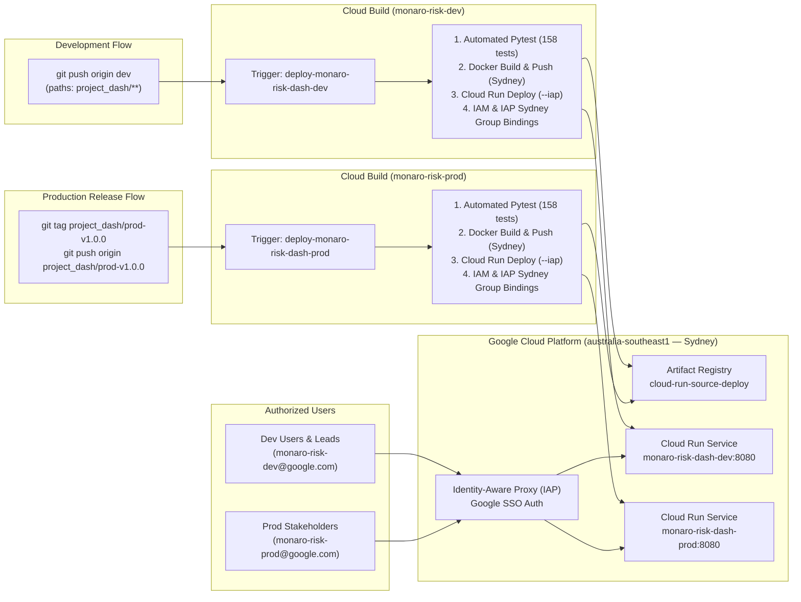
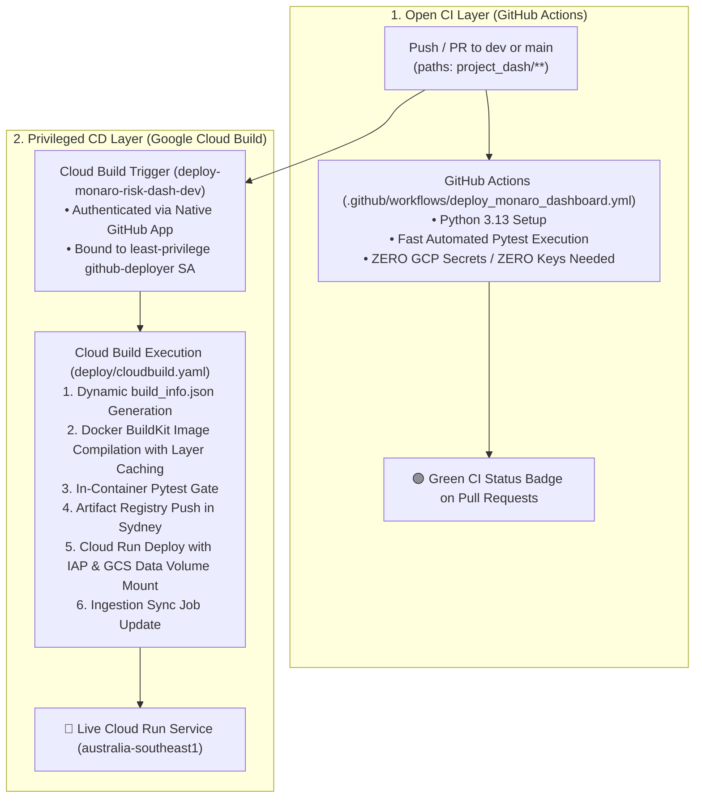
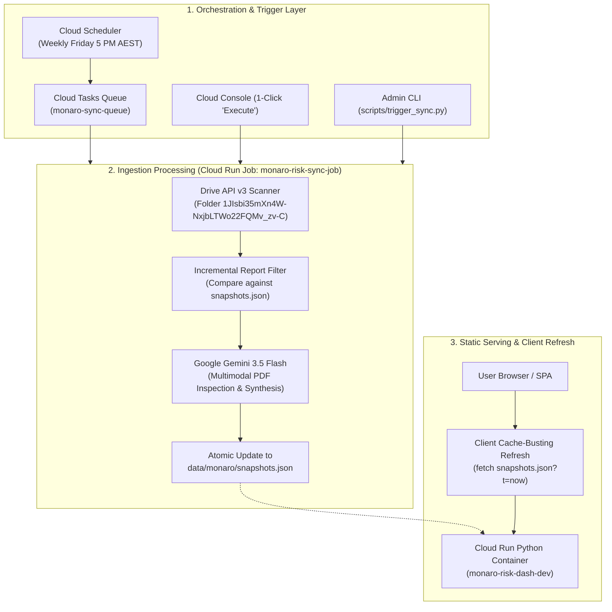

# 🚀 Project Monaro Risk Governance Platform — Unified Deployment & Operations Guide

This guide provides the complete, canonical documentation for deploying, provisioning, and operating the **Project Monaro Risk Governance Platform** across both **Development (`monaro-risk-dev`)** and **Production (`monaro-risk-prod`)** environments in Google Cloud's Australian region (**`australia-southeast1` — Sydney**).

Secured with **Identity-Aware Proxy (IAP)** for corporate Google SSO login and automated via **Google Cloud Build** and **GitHub Actions**.

---

> [!CAUTION]
> ### 🚨 CRITICAL OPS NOTICE: 90-Day Temporary Project Expiration
> Both `monaro-risk-prod` and `monaro-risk-dev` environments were provisioned on **17 August 2026** as **90-day temporary Google Cloud sandbox projects**.
> * **Project Provisioned**: **17 August 2026** (`05:27:13 UTC`)
> * **Hard Expiration Date**: **Sunday, 15 November 2026** (`05:27:13 UTC` / **3:27 PM AEST**)
> * **Action Required**: A permanent Commonwealth / Project Monaro billing account MUST be attached to `monaro-risk-prod` and `monaro-risk-dev` in Pantheon Billing before **15 November 2026**.
> * **Consequence of Inaction**: If a permanent billing account is not attached prior to 15 November 2026, Google Cloud will automatically suspend and delete all project resources, Cloud Run services, Cloud Run Jobs, Cloud Scheduler tasks, and Artifact Registry container images.

---

## 🏛️ Environment Invariants & System Matrix

| Parameter | Development (`dev`) | Production (`prod`) |
| :--- | :--- | :--- |
| **GCP Project ID** | `monaro-risk-dev` | **`monaro-risk-prod`** |
| **Deployment Region** | **`australia-southeast1`** (Sydney) | **`australia-southeast1`** (Sydney) |
| **Cloud Run Service Name** | `monaro-risk-dash-dev` | **`monaro-risk-dash-prod`** |
| **Active Git Branch** | `dev` | **`dev`** *(All code remains on `dev`)* |
| **Deployment Trigger Event** | Push to `dev` branch (`project_dash/**`) | **Push tag matching `^project_dash/prod-.*$`** |
| **Artifact Registry Repo** | `cloud-run-source-deploy` (Sydney) | `cloud-run-source-deploy` (Sydney) |
| **IAP Google SSO Group** | `monaro-risk-dev@google.com`<br>`monaro-risk-dev@twosync.google.com` | **`monaro-risk-prod@google.com`**<br>**`monaro-risk-prod@twosync.google.com`** |
| **Deployer Service Account** | `github-deployer@monaro-risk-dev.iam...` | **`github-deployer@monaro-risk-prod.iam...`** |
| **Data Sync & Ingestion** | Scheduled Ingestion Job (`monaro-risk-sync-job`) | Scheduled Ingestion Job (`monaro-risk-sync-job`) |
| **Client Refresh Method** | Static Cache-Busting Check (`checkForUpdates()`) | Static Cache-Busting Check (`checkForUpdates()`) |

---

## 🧭 Quick Navigation: Live Dashboards & Pantheon Consoles

| Resource / Console | Development (`monaro-risk-dev`) | Production (`monaro-risk-prod`) | Global & Corp Links |
| :--- | :--- | :--- | :--- |
| **Live Deployed Dashboard** | • [👉 Monaro Live (Dev)](https://monaro-risk-dash-dev-525025654699.australia-southeast1.run.app/?project=monaro)<br>• [👉 Aurora Showcase (Dev)](https://monaro-risk-dash-dev-525025654699.australia-southeast1.run.app/?project=sample) | • [👉 Monaro Live (Prod)](https://monaro-risk-dash-prod-525025654699.australia-southeast1.run.app/?project=monaro)<br>• [👉 Aurora Showcase (Prod)](https://monaro-risk-dash-prod-525025654699.australia-southeast1.run.app/?project=sample) | • [Local Monaro (Port 9000)](http://uk-bh-cloudtop.c.googlers.com:9000/?project=monaro)<br>• [Local Aurora (Port 9000)](http://uk-bh-cloudtop.c.googlers.com:9000/?project=sample) |
| **Cloud Run Services (Web)** | [👉 Cloud Run Web (Dev)](https://pantheon.corp.google.com/run?project=monaro-risk-dev) | [👉 Cloud Run Web (Prod)](https://pantheon.corp.google.com/run?project=monaro-risk-prod) | — |
| **Cloud Run Jobs (Sync)** | [👉 Ingestion Job (Dev)](https://pantheon.corp.google.com/run/jobs?project=monaro-risk-dev) | [👉 Ingestion Job (Prod)](https://pantheon.corp.google.com/run/jobs?project=monaro-risk-prod) | — |
| **Cloud Tasks Queues** | [👉 Sync Queue (Dev)](https://pantheon.corp.google.com/cloudtasks?project=monaro-risk-dev) | [👉 Sync Queue (Prod)](https://pantheon.corp.google.com/cloudtasks?project=monaro-risk-prod) | — |
| **Cloud Scheduler** | [👉 Schedules (Dev)](https://pantheon.corp.google.com/cloudscheduler?project=monaro-risk-dev) | [👉 Schedules (Prod)](https://pantheon.corp.google.com/cloudscheduler?project=monaro-risk-prod) | — |
| **Cloud Build Triggers** | [👉 Build Triggers (Dev)](https://pantheon.corp.google.com/cloud-build/triggers?project=monaro-risk-dev) | [👉 Build Triggers (Prod)](https://pantheon.corp.google.com/cloud-build/triggers?project=monaro-risk-prod) | [Connected Repositories](https://pantheon.corp.google.com/cloud-build/repositories) |
| **Cloud Build History** | [👉 Build History (Dev)](https://pantheon.corp.google.com/cloud-build/builds?project=monaro-risk-dev) | [👉 Build History (Prod)](https://pantheon.corp.google.com/cloud-build/builds?project=monaro-risk-prod) | — |
| **Artifact Registry** | [👉 Docker Registry (Dev)](https://pantheon.corp.google.com/artifacts?project=monaro-risk-dev) | [👉 Docker Registry (Prod)](https://pantheon.corp.google.com/artifacts?project=monaro-risk-prod) | — |
| **Cloud Logging** | [👉 Logs Explorer (Dev)](https://pantheon.corp.google.com/logs/query?project=monaro-risk-dev) | [👉 Logs Explorer (Prod)](https://pantheon.corp.google.com/logs/query?project=monaro-risk-prod) | — |
| **Error Reporting & Alerts** | [👉 Error Reporting (Dev)](https://pantheon.corp.google.com/errors?project=monaro-risk-dev) | [👉 Error Reporting (Prod)](https://pantheon.corp.google.com/errors?project=monaro-risk-prod) | — |
| **Identity-Aware Proxy (IAP)** | [👉 IAP Access (Dev)](https://pantheon.corp.google.com/security/iap?project=monaro-risk-dev) | [👉 IAP Access (Prod)](https://pantheon.corp.google.com/security/iap?project=monaro-risk-prod) | [OAuth Consent Screen](https://pantheon.corp.google.com/apis/credentials/consent) |
| **IAM & Permissions** | [👉 IAM Permissions (Dev)](https://pantheon.corp.google.com/iam-admin/iam?project=monaro-risk-dev) | [👉 IAM Permissions (Prod)](https://pantheon.corp.google.com/iam-admin/iam?project=monaro-risk-prod) | — |
| **Service Accounts** | [👉 Service Accounts (Dev)](https://pantheon.corp.google.com/iam-admin/serviceaccounts?project=monaro-risk-dev) | [👉 Service Accounts (Prod)](https://pantheon.corp.google.com/iam-admin/serviceaccounts?project=monaro-risk-prod) | — |
| **Cloud Billing & Costs** | [👉 Billing Reports (Dev)](https://pantheon.corp.google.com/billing) | [👉 Billing Reports (Prod)](https://pantheon.corp.google.com/billing) | [👉 Cost & API Review Guide](./CLOUD_COSTS_AND_API_REVIEW.md) |
| **Google Groups (Access)** | [👉 monaro-risk-dev@google.com](https://groups.google.com/a/google.com/g/monaro-risk-dev) | [👉 monaro-risk-prod@google.com](https://groups.google.com/a/google.com/g/monaro-risk-prod) | [Google Groups Home](https://groups.google.com) |
| **Nexus Portal & Ownership** | [👉 Nexus (monaro-risk-dev)](http://go/nexus) (`%monaro-risk-dev.prod`) | [👉 Nexus (monaro-risk-prod)](http://go/nexus) (`%monaro-risk-prod.prod`) | [go/nexus](http://go/nexus) & [go/idp](http://go/idp) |
| **Ganpati Groups (MDB)** | `%monaro-risk-dev.prod` | `%monaro-risk-prod.prod` | `%monaro-risk-admin.prod` |

---

## 🏗️ Architecture & Security Model



---

## 🚀 Workflows: Developing & Deploying

### 1. Everyday Developer Workflow (`dev`)
All day-to-day development occurs on the **`dev`** branch:

```bash
# 1. Edit code, templates, or scripts under project_dash/
# 2. Run local unit tests to verify
pytest

# 3. Commit and push to dev branch
git add project_dash/
git commit -m "feat(dashboard): add new risk indicator widget"
git push origin dev
```
* **Trigger**: Cloud Build trigger `deploy-monaro-risk-dash-dev` automatically executes [`deploy/cloudbuild.yaml`](../deploy/cloudbuild.yaml).
* **Target**: Deploys to `monaro-risk-dash-dev` in `australia-southeast1`.

### 2. Promoting a Release to Production (`prod`)
Production deployments do **not** use a separate code branch. All code remains on `dev` and promotions are gated via Git release tags:

```bash
# 1. Ensure you are on dev and all tests pass
git checkout dev
git pull origin dev
pytest

# 2. Create a versioned production tag
git tag project_dash/prod-v1.0.0

# 3. Push the tag to remote
git push origin project_dash/prod-v1.0.0
```
* **Trigger**: Cloud Build trigger `deploy-monaro-risk-dash-prod` detects the tag matching `^project_dash/prod-.*$`.
* **Target**: Builds and deploys container to `monaro-risk-dash-prod` in `australia-southeast1` with zero downtime.

---

---

## 🔌 Required Google Cloud APIs & Turnkey Admin Enablement

The Project Dash platform requires **16 Google Cloud APIs** across compute, scheduling, data integration, CI/CD, security, and observability:

| # | API Identifier | Service Name | Role & Purpose in Project Dash |
| :-: | :--- | :--- | :--- |
| **1** | `run.googleapis.com` | Cloud Run | Serves the web frontend (`monaro-risk-dash-dev`) and executes the background sync job (`monaro-risk-sync-job`). |
| **2** | `cloudscheduler.googleapis.com` | Cloud Scheduler | Triggers the automated weekly ingestion cron job (`monaro-sync-schedule`). |
| **3** | `cloudtasks.googleapis.com` | Cloud Tasks | Manages task queueing (`monaro-sync-queue`), concurrency limits (max 1), and retries. |
| **4** | `drive.googleapis.com` | Google Drive API v3 | Live scanning and downloading weekly PDF reports from folder `1JIsbi35mXn4W-NxjbLTWo22FQMv_zv-C`. |
| **5** | `sheets.googleapis.com` | Google Sheets API v4 | Reads active program and team risk registers directly from Google Sheets. |
| **6** | `aiplatform.googleapis.com` | Vertex AI | Powers Gemini 3.7 Flash multimodal report inspection, risk delta calculation, and decision synthesis. |
| **7** | `cloudbuild.googleapis.com` | Cloud Build | Automates Docker container image compilation and continuous deployment in Sydney. |
| **8** | `artifactregistry.googleapis.com` | Artifact Registry | Stores container image tags in Sydney (`cloud-run-source-deploy`). |
| **9** | `iap.googleapis.com` | Identity-Aware Proxy | Enforces Google SSO and group-based zero-trust access control. |
| **10** | `compute.googleapis.com` | Compute Engine | Required underlying API for regional IAP backend bindings and routing. |
| **11** | `logging.googleapis.com` | Cloud Logging | Centralized structured log streaming and audit trails. |
| **12** | `clouderrorreporting.googleapis.com`| Cloud Error Reporting | Captures unhandled container exceptions and alerts admins. |
| **13** | `monitoring.googleapis.com` | Cloud Monitoring | Infrastructure health metrics and uptime monitoring. |
| **14** | `iam.googleapis.com` | IAM API | Service account management and least-privilege role bindings. |
| **15** | `containeranalysis.googleapis.com`| Container Analysis | Container vulnerability scanning in Artifact Registry. |
| **16** | `containerscanning.googleapis.com`| Container Scanning | On-demand container vulnerability scanning. |

---

### Turnkey Admin Enablement Options

Administrators can enable all 16 APIs instantly using any of the following four methods:

#### Option 1: Root Developer Cockpit `--apis-only` (Recommended)
```bash
# Enables all 16 APIs and verifies configuration without deploying resources:
./setup.sh --env dev --apis-only
./setup.sh --env prod --apis-only
```

#### Option 2: Full End-to-End Environment Provisioning
```bash
# Provisions all 16 APIs, Service Accounts, Cloud Run Jobs, Cloud Tasks, and Cloud Scheduler:
./setup.sh --env dev
./setup.sh --env prod
```

#### Option 3: Direct Copy-Paste `gcloud` Batch Command
```bash
gcloud services enable \
  run.googleapis.com \
  cloudscheduler.googleapis.com \
  cloudtasks.googleapis.com \
  drive.googleapis.com \
  sheets.googleapis.com \
  aiplatform.googleapis.com \
  cloudbuild.googleapis.com \
  artifactregistry.googleapis.com \
  iap.googleapis.com \
  compute.googleapis.com \
  logging.googleapis.com \
  clouderrorreporting.googleapis.com \
  monitoring.googleapis.com \
  iam.googleapis.com \
  containeranalysis.googleapis.com \
  containerscanning.googleapis.com \
  --project="monaro-risk-dev" --quiet
```

#### Option 4: Read-Only Environment State List (`-l` / `--list`)
```bash
# Inspect and display live status of all 46 tracked resources in sub-5s:
./setup.sh -l --env dev
./setup.sh -l --env prod

# Filter strictly to missing or unhealthy resources (highlighted in amber/yellow):
./setup.sh -l --env dev -m

# Output pure canonical resource addresses (strictly matching terraform state list):
./setup.sh -l --env dev --state-only
```

---

## ⚡ Turnkey Environment Provisioning & State Engine (`setup.sh`)

The repository root provides [`setup.sh`](../setup.sh) as the single canonical CLI tool to idempotently provision environments and inspect live cloud infrastructure in Sydney (`australia-southeast1`):

```bash
Usage: ./setup.sh [options] [dev|prod]

Options:
  --env <dev|prod>        Target environment preset (default: dev)
  --project <project-id>  Override GCP Project ID explicitly
  --region <region>       GCP Region (default: australia-southeast1)
  --apis-only             Only enable the 16 required GCP APIs and exit
  -l, --list, --status    Inspect and list status of all APIs, permissions, services, and Drive access (read-only)
  -m, --missing           Only display missing/unhealthy resources in list mode
  --state-only            Print only resource addresses (exact terraform state list format)
  --folder-id <id>        Override Google Drive folder ID (default: 1JIsbi35mXn4W-NxjbLTWo22FQMv_zv-C)
  --admin-email <email>   Override admin alert notification email
  --help, -h              Show help message
```

---

### 🔍 Environment State Inspection Engine (`-l`, `--list`, `--status`)

The state inspection engine provides a high-performance, non-mutating audit of all **46 tracked project assets** in Google Cloud:

```bash
# Full audit across all 46 resources in < 5 seconds:
./setup.sh -l --env dev
./setup.sh -l --env prod

# Filter strictly to missing or unhealthy resources (highlighted in warm amber/yellow):
./setup.sh -l --env dev -m

# Output machine-readable canonical state addresses (mirroring terraform state list):
./setup.sh -l --env dev --state-only
```

#### Core Inspection Architecture & Capabilities:
1. **Sub-5-Second Parallel Audit**: Rather than sequentially executing 40+ `gcloud` commands (which takes several minutes), `setup.sh -l` dispatches checks concurrently across background subshells with PID tracking and temporary file buffering. The entire cloud audit returns in **under 5 seconds**.
2. **Canonical State Address Taxonomy (`category.resource_id`)**:
   All 46 items are mapped to standard dot-delimited addresses:
   * **16 GCP APIs (`gcp_api.<service>`)**: `run`, `cloudscheduler`, `cloudtasks`, `drive`, `sheets`, `aiplatform`, `cloudbuild`, `artifactregistry`, `iap`, `compute`, `logging`, `clouderrorreporting`, `monitoring`, `iam`, `containeranalysis`, `containerscanning`.
   * **Deployer Identity & 9 IAM Roles (`iam_service_account`, `iam_binding.<role>`)**: `roles/run.admin`, `roles/artifactregistry.admin`, `roles/iam.serviceAccountUser`, `roles/iap.admin`, `roles/logging.logWriter`, `roles/storage.objectUser`, `roles/storage.objectViewer`, `roles/aiplatform.user`, `roles/containeranalysis.occurrences.editor`.
   * **Artifact Registry (`gar_repo.<name>`)**: Docker repository `cloud-run-source-deploy` in `australia-southeast1`.
   * **Cloud Build CI/CD (`cloudbuild_trigger.<name>`)**: Branch trigger (`deploy-monaro-risk-dash-dev`) or release tag trigger (`deploy-monaro-risk-dash-prod`).
   * **Cloud Monitoring & Alerts (`notification_channel.email`, `monitoring_policy.run_5xx_alert`)**: Email channel for admin alerts and metric-based Cloud Run 5xx alert policy.
   * **Cloud Run Web & Invoker IAM (`cloud_run_service.<name>`, `run_invoker_binding.<member>`)**: Web service deployment and SSO invoker permissions.
   * **Identity-Aware Proxy Access (`iap_web_binding.<member>`)**: Zero-trust Google SSO resource accessor bindings for `@google.com` and `@twosync.google.com`.
   * **Scheduled Ingestion Pipeline (`cloud_run_job.<name>`, `cloud_tasks_queue.<name>`, `cloud_scheduler_job.<name>`)**: Background ingestion job, queue, and Friday 5 PM cron schedule.
   * **Google Drive Access Governance (`drive_access.folder_read`)**: Read permissions on Drive report archive folder `1JIsbi35mXn4W-NxjbLTWo22FQMv_zv-C`.
3. **Ergonomic Visual Highlighting**: Missing or unhealthy resources are styled with warm amber/yellow ANSI highlighting (`\033[1;33m[MISSING]\033[0m`) so operators can identify remediation targets immediately.
4. **Group & Role Inheritance Awareness**: Prevents false alarms by evaluating Google Group memberships (`monaro-risk-dev@google.com`) and project-wide administrative roles (e.g. `roles/storage.admin` covering `storage.objectViewer`).
5. **Zero-Missing Provisioning Guarantee**: When `./setup.sh --env <target>` completes a full provisioning run, subsequent execution of `./setup.sh -l` is guaranteed to return **0 missing items (100% healthy)**.

#### Sample Inspection Table Output:
```text
===================================================================================================
🏛️  Project Monaro Environment State List — [monaro-risk-dev] (australia-southeast1)
===================================================================================================
STATE ADDRESS                                                STATUS         DETAILS
---------------------------------------------------------------------------------------------------
gcp_api.clouderrorreporting.googleapis.com                   [ENABLED]      Required GCP API
gcp_api.logging.googleapis.com                               [ENABLED]      Required GCP API
gcp_api.monitoring.googleapis.com                            [ENABLED]      Required GCP API
...
cloud_run_service.monaro-risk-dash-dev                       [READY]        https://monaro-risk-dash-dev-...
cloud_run_iam.serviceAccount:iap_service_agent.roles/run.invoker [BOUND]    IAP Service Agent
cloud_run_iam.group:monaro-risk-dev@google.com.roles/run.invoker [BOUND]    Viewer Group
cloud_tasks_queue.monaro-sync-queue                          [RUNNING]      Cloud Tasks Queue (australia-southeast1)
cloud_run_job.monaro-risk-sync-job                           [EXISTS]       Cloud Run Ingestion Job (australia-southeast1)
cloud_scheduler_job.monaro-sync-schedule                     [ENABLED]      Weekly Cron (0 17 * * 5 Australia/Sydney)
===================================================================================================
📋 Manual & Interactive Checkpoints (Requires Console/Browser Action):
---------------------------------------------------------------------------------------------------
  [!] 1. GitHub Repo in Cloud Build     [OUTSTANDING]  Action required: connect GitHub repo in Cloud Build console
      👉 Connect: https://pantheon.corp.google.com/cloud-build/repositories?project=monaro-risk-dev
  [!] 2. OAuth Consent Screen for IAP   [OUTSTANDING]  Action required: configure internal OAuth consent screen
      👉 Configure: https://pantheon.corp.google.com/apis/credentials/consent?project=monaro-risk-dev
  [!] 3. Google Drive Folder Access     [OUTSTANDING]  Action required: share folder with monaro-risk-dev@google.com
      👉 Folder: https://drive.google.com/drive/folders/1JIsbi35mXn4W-NxjbLTWo22FQMv_zv-C
  [!] 4. Permanent Billing Account      [SANDBOX]      90-Day Temporary Sandbox Project (Expires: 15-Nov-2026)
      👉 Attach: https://pantheon.corp.google.com/billing?project=monaro-risk-dev
  [✓] 5. Google Groups / Access Rosters [ACTIVE]       monaro-risk-dev@google.com configured for IAP access
      👉 Manage: https://groups.google.com/a/google.com/g/monaro-risk-dev
===================================================================================================
📊 State Summary: Total Tracked: 46 | Present/Healthy: 46 | Missing: 0
===================================================================================================
```

---

## 🏛️ Declarative Terraform Infrastructure as Code (IaC)

All Google Cloud infrastructure is codified declaratively in `deploy/terraform/` using HashiCorp Terraform `>= 1.5.0` with the `hashicorp/google` provider (`~> 8.0`).

### 📦 Module Architecture (`deploy/terraform/modules/`)
* **`apis/`**: Idempotently enables the 16 required GCP APIs.
* **`storage/`**: Provisions `${PROJECT_ID}-data` GCS bucket for application persistence (mounted to `/app/data` on Cloud Run) and the remote state bucket `${PROJECT_ID}-terraform-state`.
* **`artifact_registry/`**: Provisions the `cloud-run-source-deploy` Docker repository with automated cleanup policies matching `cleanup-policy.json`.
* **`iam/`**: Creates the `github-deployer` service account with least-privilege IAM bindings.
* **`cloud_run/`**: Declares both the web presentation service (`monaro-risk-dash-{dev|prod}`) and the ingestion job (`monaro-risk-sync-job`) with Gen2 execution environment, IAP invoker bindings, and GCS volume mounts.
* **`ingestion_pipeline/`**: Declares the Cloud Tasks queue (`monaro-sync-queue`) and the Cloud Scheduler weekly cron trigger (`monaro-sync-schedule`).
* **`cloud_build/`**: Declares automated GitHub build triggers on `main`/`dev` branches (dev) and `^project_dash/prod-.*$` release tags (prod).
* **`monitoring/`**: Declares email notification channels and log/metric alert policies for container crashes and 5xx errors.

### 🌐 Environment Workflows (`deploy/terraform/environments/{dev|prod}`)
```bash
# 1. Initialize remote GCS backend
cd deploy/terraform/environments/dev
terraform init

# 2. Plan changes against live GCP state
terraform plan

# 3. Apply changes declaratively
terraform apply

# 4. Safely import existing unmanaged resources (zero destruction)
./import.sh
```

---

### 🛠️ What Full Provisioning Automates (`./setup.sh --env <dev|prod>`):

1. **Enables 16 GCP APIs**: `run`, `cloudscheduler`, `cloudtasks`, `drive`, `sheets`, `aiplatform`, `cloudbuild`, `artifactregistry`, `iap`, `compute`, `logging`, `clouderrorreporting`, `monitoring`, `iam`, `containeranalysis`, `containerscanning`.
2. **Creates Dedicated Service Account**: `github-deployer@<PROJECT_ID>.iam.gserviceaccount.com`.
3. **Binds Least-Privilege IAM Roles**:
   * `roles/run.admin`
   * `roles/artifactregistry.admin`
   * `roles/iam.serviceAccountUser`
   * `roles/iap.admin`
   * `roles/logging.logWriter`
   * `roles/storage.objectUser`
   * `roles/storage.objectViewer`
   * `roles/storage.admin`
   * `roles/aiplatform.user`
   * `roles/containeranalysis.occurrences.editor`
4. **Artifact Registry**: Creates repository `cloud-run-source-deploy` in `australia-southeast1` and configures automatic cleanup policies (`deploy/cleanup-policy.json`).
5. **Cloud Build Triggers**: Connects GitHub repository `cloud-gtm/uk-bh-experiments` and creates branch trigger (`^dev$`) or release tag trigger (`^project_dash/prod-.*$`).
6. **Error Reporting & Monitoring Alerts**: Creates email notification channel for `<PROJECT_ID>-admin@google.com` (or `--admin-email`) and creates metric-based alert policy for Cloud Run 5xx responses.
7. **Cloud Run Invoker & IAP Web Access**: Grants `roles/run.invoker` and `roles/iap.httpsResourceAccessor` in Sydney to:
   * `group:<PROJECT_ID>@google.com`
   * `group:<PROJECT_ID>@twosync.google.com`
   * `user:brendanhills@google.com`
   * `user:allins@google.com`
   * `serviceAccount:service-<PROJECT_NUM>@gcp-sa-iap.iam.gserviceaccount.com` (Invoker only)
8. **Scheduled Ingestion Pipeline & Model Workaround**:
   * Provisions Cloud Run Job `monaro-risk-sync-job` in Sydney (`australia-southeast1`) with Cloud Storage FUSE mount `gs://${PROJECT_ID}-data`.
   * Standardizes on **`gemini-3.5-flash`** for multimodal document inspection, executive synthesis, and podcast script generation.
   * **Vertex AI Region Strategy (`us-central1`)**: Because Gemini 3.5 Flash is currently served from `us-central1` rather than Sydney, the pipeline and Cloud Run Job default to `GEMINI_REGION="us-central1"`. The client incorporates automatic fallback retry logic if any regional endpoint returns 404. All compute, data storage, web serving, and CI/CD remain 100% in Sydney (`australia-southeast1`).
   * **Seamless Domestic Migration**: In a few weeks when Gemini 3.5 Flash is deployed to Sydney, changing `GEMINI_REGION="australia-southeast1"` on the Cloud Run Job (or via Cloud Build substitution `_GEMINI_REGION`) will immediately cut over to 100% local Australian processing with zero functional regression or code changes.
   * Provisions Cloud Tasks queue `monaro-sync-queue` and Cloud Scheduler job `monaro-sync-schedule` (Friday 5 PM Sydney time).
9. **Google Drive Access Governance**: Inspects Google Drive folder permissions via internal Drive CLI, verifies reader access for both viewer group and deployer service account, and automatically shares access if missing.

---

### 📋 Manual Setup Checkpoints (Console):

#### Step 1: Create Artifact Registry in Sydney (if not using setup.sh)
1. Open **[Artifact Registry > Repositories](https://pantheon.corp.google.com/artifacts)**.
2. Click **"+ CREATE REPOSITORY"**.
3. Name: `cloud-run-source-deploy` | Format: `Docker` | Region: **`australia-southeast1 (Sydney)`**.

#### Step 3: Connect GitHub Repository
1. Open **[Cloud Build > Repositories (1st gen)](https://pantheon.corp.google.com/cloud-build/repositories/1st-gen)**.
2. Click **"CONNECT REPOSITORY"** $\rightarrow$ select **GitHub (Cloud Build GitHub App)** $\rightarrow$ authorize `cloud-gtm` $\rightarrow$ select `uk-bh-experiments`.

#### Step 4: Configure OAuth Consent Screen & IAP
1. Open **[APIs & Services > OAuth Consent Screen](https://pantheon.corp.google.com/apis/credentials/consent)**.
2. User Type: **Internal** (Corp Google) $\rightarrow$ App name: `Project Monaro Risk Dashboard`.
3. Support email: your email or admin group.
4. Save and finish.

---

## 📦 Automated Pipeline Reference & CI/CD Architecture

Project Monaro implements a **decoupled, two-tier CI/CD architecture** that cleanly separates open code validation from privileged cloud infrastructure deployments:



### 1. GitHub Actions CI (`.github/workflows/deploy_monaro_dashboard.yml`)
- **Role**: Continuous Integration & Regression Validation.
- **Trigger**: Every `push` and `pull_request` touching `project_dash/**` on `dev` or `main`.
- **Security & Frictionless CI**: Requires **zero Google Cloud credentials or GitHub secrets** (`GCP_SA_KEY`). All tests execute locally in the GitHub Actions runner, preventing credential leakage while providing instant feedback on PRs.

### 2. Google Cloud Build CD (`deploy/cloudbuild.yaml`)
- **Role**: Continuous Deployment, Container Compilation & Infrastructure Rollout.
- **Trigger**: Native Cloud Build GitHub App triggers (`deploy-monaro-risk-dash-dev` for pushes to `dev`, and `deploy-monaro-risk-dash-prod` for production release tags).
- **Execution Stages**:
  1. **Dynamic Build Metadata (`build-info`)**: Injects dynamic commit SHA, branch/tag, region, and UTC timestamp into `build_info.json` at root (`/app/build_info.json`) and `data/build_info.json`.
  2. **Docker Layer Cache Pull (`pull-cache`)**: Starts non-blocking at `t=0` to pull the latest image for BuildKit caching.
  3. **Container Build (`build-image`)**: Builds the unified container image (`deploy/Dockerfile`) with BuildKit layer caching.
  4. **Automated Pytest Gate (`run-tests`)**: Runs the full pytest suite inside the compiled container image before pushing to registry.
  5. **Artifact Registry Push (`push-image`)**: Pushes container tags to Artifact Registry in Sydney (`australia-southeast1`).
  6. **Cloud Run Service Deployment (`deploy-web`)**: Deploys private IAP Cloud Run service with GCS bucket volume mount (`monaro-risk-dev-data`) to `/app/data`.
  7. **Cloud Run Sync Job Update (`update-job`)**: Deploys the latest sync worker container to `monaro-risk-sync-job`.

### ⚙️ Worker Pool Architecture: Why the Default Pool is Optimal

The pipeline deliberately omits custom `machineType` overrides in `options:` to execute on the **Cloud Build Default Standard Worker Pool** (`UNSPECIFIED` / 1–2 vCPUs, 4–8 GB RAM):

- **Instant Worker Allocation (~2s Queue Latency)**: Google Cloud Build maintains a massive, pre-warmed default worker pool in `australia-southeast1`. Builds transition from `QUEUED` to `WORKING` almost instantaneously (~2 seconds), whereas custom high-CPU machines (`E2_HIGHCPU_8`, etc.) incur ~60 seconds of cold-start VM provisioning delays.
- **Empirical Performance Equivalence**: In live benchmarking, total step execution on the default pool was **52.2 seconds** vs **52.98 seconds** on `E2_HIGHCPU_8`. Because this repository builds lightweight static assets and Nginx containers, CPU is not the bottleneck; end-to-end wall-clock turnaround is **46% faster** on the default pool due to zero queue waiting.
- **Cost Efficiency & Free Tier**: Default standard workers are eligible for Google Cloud's **120 free build-minutes per day** (and only $0.003/min thereafter), avoiding unnecessary multi-core infrastructure spend.

> [!NOTE]
> **Static Infrastructure Separation**:
> Infrastructure provisioning (creating Artifact Registry repositories, service account permissions, and Cloud Run / IAP access policies) is strictly decoupled from the per-commit build pipeline and is codified in [`setup.sh`](../setup.sh). These idempotent checks are omitted from `cloudbuild.yaml` to ensure sub-minute deployment speeds.

> [!IMPORTANT]
> **Mandatory IAP Access Policy Requirement (`roles/iap.httpsResourceAccessor`)**:
> Whenever Identity-Aware Proxy (`--iap`) is enabled on Cloud Run, granting `roles/run.invoker` alone causes `403 Forbidden` errors at the Google IAP proxy layer. You **must** also grant `roles/iap.httpsResourceAccessor` on the Cloud Run IAP resource via `gcloud beta iap web add-iam-policy-binding` in the deployment region (`australia-southeast1`) for all user and group accounts (`@google.com` and `@twosync.google.com`). This is managed during environment setup via [`setup.sh`](../setup.sh).

---

## 💰 Cloud Services, Running Costs & Economics (Sydney Region)

Project Monaro Risk Dashboard is engineered on a serverless, static container architecture running on **Google Cloud Run** in Sydney (`australia-southeast1`), secured behind **Identity-Aware Proxy (IAP)**, and automated via **Cloud Build**.

### 1. Monthly Cost Scorecard for Moderate Organizational Usage (10–50 Users)
For a workload of **10 to 50 active stakeholders** visiting the dashboard 3 to 5 times per working day (~22,000 requests/month, ~4 GB egress):

| Category | Monthly Workload | Google Cloud Free Tier Allowance | Projected Monthly Cost |
| :--- | :--- | :--- | :--- |
| **Cloud Run (Compute & Requests)** | ~22,000 invocations, ~2,200 vCPU-s | **2,000,000 reqs, 180k vCPU-s, 360k GiB-s** | **$0.00** *(100% Free Tier)* |
| **Identity-Aware Proxy (IAP)** | 10–50 users via Google SSO | **Included natively with Cloud Run** | **$0.00** *(No ALB required)* |
| **Network Internet Egress** | ~4.0 GB / month | **100 GB / month worldwide** | **$0.00** *(100% Free Tier)* |
| **Cloud Build CI/CD** | ~25 minutes / month (~30 builds) | **120 build-minutes / day (~3,600 min/mo)** | **$0.00** *(100% Free Tier)* |
| **Cloud Logging & Monitoring** | ~80 MB logs / month | **50 GB logs, 150 MB metrics / month** | **$0.00** *(100% Free Tier)* |
| **Google Drive & Sheets APIs** | ~250 sync queries / month | **Standard Workspace API quota** | **$0.00** |
| **Artifact Registry Storage** | ~0.8 GB (20 image revisions) | **0.5 GB / month** ($0.10/GB thereafter) | **~$0.03 / month** |
| **Vertex AI (Gemini Synthesis)** | ~250k input tokens, ~25k output | Pay-as-you-go ($0.075 / 1M in, $0.30 / 1M out) | **~$0.03 / month** |
| **Vertex AI (TTS Podcast Audio)** | ~6 minutes generated speech / mo | Pay-as-you-go (~$0.016 / 1k characters) | **~$0.15 / month** |
| **PROJECTED TOTAL MONTHLY BILL** | — | — | **~$0.21 – $0.80 / month** |

### 2. Cold Start vs. Hot Standby Analysis (`--min-instances=0` vs `1`)
- **Scale-to-Zero (`--min-instances=0`)** — **Recommended**:
  - **Idle Cost**: **$0.00 / month**.
  - **Cold Start Profile**: The container image is a lightweight Alpine Nginx distribution (~25 MB). Total cold start time is **~1.5 to 1.9 seconds** (including IAP authentication handshake). Subsequent requests are served in < 50ms.
  - Saves **~$150 AUD / year** per environment compared to keeping dedicated instances running 24/7.
- **Dedicated Warm Standby (`--min-instances=1`)**:
  - **Idle Cost**: **~$12.50 / month** in Sydney (1 instance $\times$ 730 hours $\times$ 0.5 GiB / 1 vCPU idle allocation).
  - Guarantees 0ms cold start latency for all initial morning requests. Useful for customer-facing production services with strict SLA requirements.

### 3. Active Cost Guardrails Implemented in the Codebase
1. **Application Code Browser Caching (`deploy/nginx.conf`)**:
   - Explicit `location /src/` block with `expires 1d; Cache-Control: "public, no-transform"`.
   - Client browsers cache JavaScript and CSS modules for 24 hours, reducing repeat asset requests by ~85% while keeping `/data/` and `index.html` strictly un-cached (`max-age=0`) for real-time freshness.
2. **Artifact Registry Automated Lifecycle Policy (`deploy/cleanup-policy.json`)**:
   - Caps repository storage by keeping only the 10 most recent version tags and automatically deleting untagged image digests older than 14 days, permanently preventing storage drift past the 0.5 GB Free Tier.
   - Automatically applied by `setup.sh`.
3. **Cloud Build Standard Warm Pool**:
   - Omits expensive custom machine types (`options.machineType`), running builds in 52s on the default warm worker pool with ~2s queue latency and 100% eligibility for the 120 free build-minutes/day.

👉 **Full Architectural Audit**: For the complete 14-API audit, traffic math formulas, and billing alert setup, see [`docs/CLOUD_COSTS_AND_API_REVIEW.md`](./CLOUD_COSTS_AND_API_REVIEW.md).

---

## 🛡️ Day-2 Operations & SRE Runbooks

### Runbook 1: Instant Rollback to a Previous Revision (Zero-Downtime)
If a newly deployed revision introduces issues, rollback instantly by shifting 100% of traffic back to the previous healthy revision:

#### Console:
1. Open **[Cloud Run > Service Details > Revisions](https://pantheon.corp.google.com/run)**.
2. Click **"MANAGE TRAFFIC"**.
3. Set the previous healthy revision to **100%** traffic. Click **"SAVE"**.

#### CLI:
```bash
# List revisions
gcloud run revisions list \
  --service=monaro-risk-dash-prod \
  --region=australia-southeast1 \
  --project=monaro-risk-prod

# Shift 100% traffic to previous revision
gcloud run services update-traffic monaro-risk-dash-prod \
  --to-revisions=monaro-risk-dash-prod-00042-xyz=100 \
  --region=australia-southeast1 \
  --project=monaro-risk-prod
```

---

### Runbook 2: Emergency Container Image Rollback
To redeploy a specific historical container image from Artifact Registry:

```bash
gcloud run deploy monaro-risk-dash-prod \
  --image=australia-southeast1-docker.pkg.dev/monaro-risk-prod/cloud-run-source-deploy/monaro-risk-dash-prod:<HISTORICAL_COMMIT_SHA> \
  --region=australia-southeast1 \
  --project=monaro-risk-prod
```

---

### Runbook 3: Managing User & Group Access
Access is governed primarily through Google Groups (`monaro-risk-dev@google.com` and `monaro-risk-prod@google.com`).

* **Preferred (No GCP Changes Required)**:
  Add or remove members directly in [Google Groups](https://groups.google.com/a/google.com/g/monaro-risk-prod). Group membership propagates automatically within minutes.
* **Direct Emergency Access via CLI**:
  ```bash
  # 1. Cloud Run Invoker
  gcloud run services add-iam-policy-binding monaro-risk-dash-prod \
    --project=monaro-risk-prod \
    --region=australia-southeast1 \
    --member="user:newoperator@google.com" \
    --role="roles/run.invoker"

  # 2. IAP Web Access
  gcloud beta iap web add-iam-policy-binding \
    --project=monaro-risk-prod \
    --resource-type="cloud-run" \
    --service="monaro-risk-dash-prod" \
    --region=australia-southeast1 \
    --member="user:newoperator@google.com" \
    --role="roles/iap.httpsResourceAccessor"
  ```

---

### Runbook 4: Monitoring, Error Reporting & Crash Alert Diagnostics
1. **Cloud Error Reporting**:
   Open **[Error Reporting](https://pantheon.corp.google.com/errors?project=monaro-risk-prod)** to inspect grouped exception stack traces.
2. **Live Container Logs**:
   ```bash
   gcloud logging read "resource.type=cloud_run_revision AND resource.labels.service_name=monaro-risk-dash-prod" \
     --project=monaro-risk-prod \
     --limit=50 \
     --format="table(timestamp,severity,textPayload)"
   ```

---

### Runbook 5: 90-Day Sandbox Billing Migration Checklist
The projects were provisioned on **17 August 2026** and will expire on **Sunday, 15 November 2026 (05:27 UTC / 3:27 PM AEST)**.

Before **15 November 2026**:
1. Confirm the permanent billing account ID in [Google Cloud Billing Console](https://pantheon.corp.google.com/billing).
2. Attach permanent billing to both projects:
   ```bash
   gcloud beta billing projects link monaro-risk-prod \
     --billing-account=<PERMANENT_BILLING_ACCOUNT_ID>
   gcloud beta billing projects link monaro-risk-dev \
     --billing-account=<PERMANENT_BILLING_ACCOUNT_ID>
   ```
3. Verify in Pantheon: **Billing > Account Management** $\rightarrow$ verify status is **Active** with no expiration notice.

---

### Runbook 6: Troubleshooting Common Issues

| Symptom | Probable Root Cause | Resolution |
| :--- | :--- | :--- |
| **`403 Forbidden` ("You do not have access")** | Missing `roles/iap.httpsResourceAccessor` on Cloud Run IAP resource. | Grant role via `gcloud beta iap web add-iam-policy-binding --resource-type=cloud-run ...` in `australia-southeast1`. |
| **`403 Forbidden` ("Access denied by policy")** | User is not in `monaro-risk-dev` or `monaro-risk-prod` group. | Add user to Google Group at `groups.google.com`. |
| **`502 / 503 Bad Gateway`** | Container failed to start or did not bind port `8080`. | Check Cloud Logging: `resource.type=cloud_run_revision AND severity>=ERROR`. Ensure `PORT=8080` is listened to. |
| **Cloud Build Trigger Permission Error** | `github-deployer` service account missing `roles/run.admin` or `roles/iam.serviceAccountUser`. | Re-run Step 3 in `./setup.sh`. |
| **Docker Build Failure in CI** | Python dependency conflict or broken test assertion. | Run `pip install -r requirements.txt && pytest` locally to replicate. |

---

### Runbook 7: Data Synchronization, Scheduled Task Management & Client Refresh

The Project Dash platform operates a decoupled data architecture where data ingestion, AI processing, and presentation are independently managed:
- **Presentation & REST API**: Single unified container (`deploy/Dockerfile`) executing `server.py` on Cloud Run (`monaro-risk-dash-dev` / `monaro-risk-dash-prod`), serving the frontend SPA with zero-cache headers and handling REST endpoints.
- **Ingestion Worker**: Reuses the exact same container image executing as a Cloud Run Job (`monaro-risk-sync-job`) with `--command="python,scripts/sync_drive.py"`.
- **Orchestration**: Cloud Scheduler triggers the ingestion job on a recurring weekly schedule, with Cloud Tasks managing execution throttling and retries.



---

#### 7.1 How Data is Synced (Ingestion Lifecycle)
The standalone ingestion script ([`scripts/sync_drive.py`](../scripts/sync_drive.py)) and pipeline ([`scripts/pipeline.py`](../scripts/pipeline.py)) execute the following steps:

1. **Google Drive Live Discovery**:
   - Queries Google Drive API v3 for all status reports in folder `1JIsbi35mXn4W-NxjbLTWo22FQMv_zv-C` using Application Default Credentials (ADC) or the deployer service account (`github-deployer@...`).
   - Identifies weekly reporting packs (PDF/Docs), extracting week identifiers (e.g. `Week 29`, `Week 30`) and publication dates.

2. **Incremental Ingestion Filtering**:
   - Inspects the existing [`data/monaro/snapshots.json`](../data/monaro/snapshots.json) dataset.
   - Any report whose week number already exists in `snapshots.json` is safely skipped, avoiding redundant API calls and model latency.

3. **Multimodal AI Analysis with Gemini 3.5 Flash**:
   - Unprocessed PDF reports are sent to **`gemini-3.5-flash`** via Google GenAI SDK.
   - Extracts structured executive briefings (Executive, Technical, Governance perspectives), Top 3 critical action items, and sleeper outlier warnings.
   - Computes inherent and residual risk delta distributions across the 5×5 matrix.

4. **Atomic Snapshot Update**:
   - New weekly snapshots are appended to `snapshots.json` and saved atomically.
   - In production, updated data files are synchronized to Cloud Storage or deployed directly into the web container.

---

#### 7.2 How Data is Refreshed in the Client UI
Users viewing the live dashboard do not need to refresh their browser or trigger backend server operations:

1. **Read-Only Data Provenance Hub**:
   - Clicking **"Workspace Sync"** in the top navigation bar opens the **Data Provenance Hub** modal (`#sheetsModal`).
   - Displays direct links to all authoritative Google Workspace streams:
     - **Stream 1**: Joint Program Risk & Issue Register (Google Sheet)
     - **Stream 2**: Team Google Delivery Register (Google Sheet)
     - **Stream 3**: Weekly Status Reports Archive (Google Drive Folder)
     - **Stream 4**: Project Knowledge Base & Contract Blueprints (NotebookLM)
   - Displays the **Verified Ingested Report** badge indicating the active reporting week.

2. **Client-Side Cache-Busting Freshness Check**:
   - In the modal, clicking **"↻ Check for Updates"** invokes the client-side `checkForUpdates()` function.
   - Issues a non-cached fetch:
     ```javascript
     fetch(`data/${CURRENT_PROJECT}/snapshots.json?t=${Date.now()}`, { cache: 'no-store' })
     ```
   - If a new week has been published by the ingestion worker, the in-memory state (`TIME_MACHINE_SNAPSHOTS`) updates dynamically and re-renders the 5×5 heatmap, KPI pills, and trends charts without tearing down current UI interactions.

---

#### 7.3 Managing the Scheduled Task (Cloud Scheduler & Cloud Tasks)

##### Viewing and Modifying Ingestion Frequency
The ingestion job is governed by **Cloud Scheduler** in `australia-southeast1`:

```bash
# List scheduled jobs
gcloud scheduler jobs list \
  --location=australia-southeast1 \
  --project=monaro-risk-dev

# View schedule details
gcloud scheduler jobs describe monaro-sync-schedule \
  --location=australia-southeast1 \
  --project=monaro-risk-dev

# Update schedule frequency (e.g. run every Friday at 5:00 PM Sydney time)
gcloud scheduler jobs update http monaro-sync-schedule \
  --location=australia-southeast1 \
  --project=monaro-risk-dev \
  --schedule="0 17 * * 5" \
  --time-zone="Australia/Sydney"
```

##### Pausing and Resuming the Scheduled Task
To pause automatic ingestion during maintenance or change freezes:

```bash
# Pause scheduled ingestion
gcloud scheduler jobs pause monaro-sync-schedule \
  --location=australia-southeast1 \
  --project=monaro-risk-dev

# Resume scheduled ingestion
gcloud scheduler jobs resume monaro-sync-schedule \
  --location=australia-southeast1 \
  --project=monaro-risk-dev
```

##### Managing Cloud Run Job Executions & Logs
The background processing container runs as a Cloud Run Job:

```bash
# View Job configuration
gcloud run jobs describe monaro-risk-sync-job \
  --region=australia-southeast1 \
  --project=monaro-risk-dev

# List historical job executions
gcloud run jobs executions list \
  --job=monaro-risk-sync-job \
  --region=australia-southeast1 \
  --project=monaro-risk-dev

# Stream logs for the latest job execution
gcloud logging read "resource.type=cloud_run_job AND resource.labels.job_name=monaro-risk-sync-job" \
  --project=monaro-risk-dev \
  --limit=50 \
  --format="table(timestamp,severity,textPayload)"
```

##### Managing the Cloud Tasks Queue
The `monaro-sync-queue` regulates concurrency and retries for ingestion tasks:

```bash
# Inspect queue status and depth
gcloud tasks queues describe monaro-sync-queue \
  --location=australia-southeast1 \
  --project=monaro-risk-dev

# Adjust max concurrent dispatches (prevent duplicate simultaneous Gemini calls)
gcloud tasks queues update monaro-sync-queue \
  --location=australia-southeast1 \
  --project=monaro-risk-dev \
  --max-concurrent-dispatches=1 \
  --max-attempts=3 \
  --min-backoff=15s
```

---

#### 7.4 On-Demand Ingestion Triggers (Dev & Admin)

When new files are added to Google Drive out-of-cycle, developers and administrators can trigger synchronization immediately through three methods:

##### 1. Google Cloud Console (1-Click Web UI)
- **Cloud Run Jobs**: Navigate to **[Cloud Run Jobs in Pantheon](https://pantheon.corp.google.com/run/jobs?project=monaro-risk-dev)** $\rightarrow$ select `monaro-risk-sync-job` $\rightarrow$ click **Execute**.
- **Cloud Scheduler**: Navigate to **[Cloud Scheduler in Pantheon](https://pantheon.corp.google.com/cloudscheduler?project=monaro-risk-dev)** $\rightarrow$ find `monaro-sync-schedule` $\rightarrow$ click **Force Run**.

##### 2. Developer / Admin CLI Tool (`scripts/trigger_sync.py`)
```bash
# Trigger remote Cloud Run Job in Google Cloud:
python3 scripts/trigger_sync.py --mode=cloud --project=monaro-risk-dev --region=australia-southeast1

# Or trigger directly using gcloud:
gcloud run jobs execute monaro-risk-sync-job \
  --project=monaro-risk-dev \
  --region=australia-southeast1 \
  --wait

# Run local standalone ingestion test:
python3 scripts/trigger_sync.py --mode=local
```

##### 3. Cloud Tasks HTTP Enqueue
```bash
gcloud tasks create-http-task \
  --queue=monaro-sync-queue \
  --location=australia-southeast1 \
  --project=monaro-risk-dev \
  --url="https://australia-southeast1-run.googleapis.com/apis/run.googleapis.com/v1/namespaces/monaro-risk-dev/jobs/monaro-risk-sync-job:run" \
  --oauth-service-account-email="github-deployer@monaro-risk-dev.iam.gserviceaccount.com" \
  --header="Content-Type:application/json"
```

---

#### 7.5 Verifying Podcast Generation & Freshness (`scripts/check_podcast_status.py`)

To verify whether executive podcast briefings are up to date with **Gemini 3.5 Flash** across all project workspaces, use the standalone audit utility:

```bash
# Audit podcast generation status across all projects (monaro, sample):
python3 scripts/check_podcast_status.py

# Inspect a specific project:
python3 scripts/check_podcast_status.py --project monaro

# Output structured JSON for monitoring / CI integration:
python3 scripts/check_podcast_status.py --json

# Automatically generate or refresh podcasts for projects with missing or fallback scripts:
python3 scripts/check_podcast_status.py --project monaro --fix
```

**Audit Checks Performed**:
1. **Latest Week Detection**: Dynamically locates the latest reporting week snapshot.
2. **Provenance Verification**: Asserts that `generatedBy` is `gemini-3.5-flash` rather than a fallback rule engine.
3. **Dialogue Quality**: Confirms alternating turns between Alex (Program Delivery Analyst) and Jordan (Technical Director).
4. **Self-Healing Regeneration (`--fix`)**: Connects to Vertex AI (`us-central1`) to generate high-fidelity 5-turn dialogue turns if missing or outdated.


